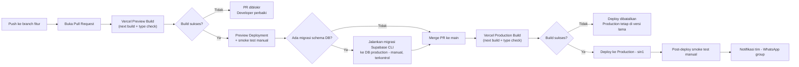

# Deployment & Maintenance Plan — Landing Page Klinik Cahaya Medika

> **Catatan konteks:** Dokumen ini adalah dokumen keenam dalam rantai standar proyek NobleDev (PRD → SOW → User Flow & Wireframe → Technical Spec → Timeline & Milestones → **Deployment & Maintenance Plan**), diturunkan dari **PRD v1.1**, **SOW** (Fixed-price, Rp 15.000.000 ilustratif), **Technical Spec** (monolith tipis Next.js + Supabase, region Singapore, on-demand ISR), dan **Timeline & Milestones** (kickoff ilustratif 18 Agustus 2026, go-live 1 Oktober 2026). Klinik Cahaya Medika tetap studi kasus ilustratif/template internal, bukan klien nyata. Dokumen ini **engineering-facing** — untuk tim dev NobleDev dan siapa pun yang memegang akses produksi pasca-handover, bukan dokumen sign-off klien.

| Field | Detail |
|---|---|
| Referensi PRD | Landing Page Klinik Cahaya Medika, v1.1 |
| Referensi SOW | Landing Page Klinik Cahaya Medika (Fixed-price, Rp 15.000.000 ilustratif) |
| Referensi Tech Spec | Klinik Cahaya Medika Technical Spec (monolith tipis, Next.js + Supabase Singapore, on-demand ISR) |
| Referensi Timeline & Milestones | Kickoff ilustratif Sel, 18 Agu 2026; Go-live target Kam, 1 Okt 2026 (M7) |
| Tier Dokumen | **Standard** (mengikuti "Tingkat Dokumen" di cover PRD) |
| Target Go-Live | Kam, 1 Oktober 2026 *(mengikuti M7 di Timeline §3 — subject to §9 assumption soal selisih estimasi PRD vs. SOW)* |
| Pemilik Operasional Pasca-Launch | NobleDev (operasional) selama build + 30 hari garansi pasca serah terima; setelah itu mengikuti pilihan klien — retainer (NobleDev tetap operasional) atau transfer penuh ke klien. **Diputuskan di §11**, siap dikunci ke SOW §9 pada engagement nyata |
| Status | Draft — Template Internal, 2 item terbuka dari revisi sebelumnya sudah diputuskan (lihat §2, §11, §12.1) |

---

## Daftar Isi

1. Overview
2. Environment Strategy
3. CI/CD Pipeline
4. Deployment Strategy & Release Process
5. Rollback Strategy
6. Monitoring & Alerting
7. Backup & Disaster Recovery
8. Incident Runbooks
9. Maintenance Schedule
10. Security & Access Control
11. Support Boundary & Escalation
12. Assumptions & Open Questions
13. Change Control Note

---

## 1. Overview

Dokumen ini menjawab pertanyaan yang belum sepenuhnya dijawab oleh lima dokumen sebelumnya: **bagaimana sistem ini dideploy dengan aman, dan siapa yang menjaganya tetap berjalan setelah live.** Proyek ini adalah landing page satu halaman (multi-section) untuk klinik keluarga, dengan panel admin ringan terpisah — dibangun di atas **Next.js 14+ (App Router, SSG + on-demand ISR)**, **Supabase** (Postgres + Auth + RLS + Storage, region Singapore), dan **Vercel** (hosting, function region `sin1`), sesuai Tech Spec §2–§3. Tim proyek adalah **1 developer solo** (Tech Spec cover), tanpa split tim/service — konsekuensinya, seluruh struktur dokumen ini (pipeline, rollback, on-call, eskalasi) sengaja disederhanakan agar realistis dijalankan satu orang, bukan meniru struktur tim enterprise.

Target go-live mengikuti **M7 — Launch & serah terima final** di Timeline §3 (Kamis, 1 Oktober 2026).

**Revisi ini menutup dua item terbuka dari draft sebelumnya**, masing-masing dijawab dari sudut pandang peran yang paling relevan (pola yang sama dipakai Tech Spec §9.1 untuk pertanyaan teknis terbuka — sudut pandang berbeda untuk keputusan infra vs. keputusan komersial):

1. **Penugasan Supabase project untuk Preview Deployment** — dijawab dari sudut pandang *Infrastructure/Backend Engineer* — lihat §2 dan §12.1 poin 1.
2. **Struktur dukungan pasca-launch & kepemilikan akses produksi** — dijawab dari sudut pandang *Agency Principal/Account Manager NobleDev*, karena ini keputusan komersial, bukan fakta teknis yang bisa diverifikasi lewat dokumentasi — lihat §11 dan §12.1 poin 2.

Keduanya sekarang berstatus **keputusan default template**, bukan lagi item terbuka — kalau proyek ini jadi engagement nyata, keputusan ini tinggal disalin ke SOW §9 "Ketentuan Lain" (saat ini masih `[ISI]`) untuk sign-off klien, bukan dirancang ulang dari nol.

---

## 2. Environment Strategy

| Environment | Tujuan | Infra/Hosting | Access Control | Data |
|---|---|---|---|---|
| **Local/Dev** | Development harian di mesin developer | Next.js dev server lokal + Supabase project **development** terpisah (atau Supabase local via CLI, Tech Spec §8) | Hanya Solo Developer – NobleDev | Sintetis/dummy (contoh: jadwal & layanan dummy, bukan data klinik nyata) |
| **Preview** (per Pull Request) | Review sebelum merge ke `main`; berfungsi sebagai lapisan staging | Vercel Preview Deployment otomatis per PR (bawaan git integration Vercel, Tech Spec §8) | Solo Developer – NobleDev; link preview bisa dibagikan ke PM/klien untuk review visual bila perlu | Supabase project **development** — bukan production (**diputuskan**, lihat §12.1 poin 1) |
| **Production** | Live untuk pengunjung & admin klinik | Vercel Production deployment dari branch `main`, function region `sin1`, terhubung Supabase project **production** (region Singapore) | Solo Developer – NobleDev (owner), Pemilik Klinik (co-owner Vercel/Supabase — struktur akses **diputuskan** di §11) | Data nyata (setelah konten final dikonfirmasi Fase 1) |

**Catatan staging:** Tech Spec §9.1 poin 3 sudah memutuskan **tidak ada environment staging permanen terpisah** untuk MVP ini — Preview Deployment per PR dianggap cukup. Pemicu yang mengubah keputusan ini tetap sama seperti dicatat Tech Spec §9.1: begitu scope naik ke payment gateway/booking system (Exclusions SOW §3), staging permanen dengan domain tetap jadi kebutuhan nyata (webhook callback butuh URL stabil).

**Keputusan — penugasan Supabase project untuk Preview** *(dijawab dari sudut pandang Infrastructure/Backend Engineer, menutup gap yang belum eksplisit di Tech Spec)*:

Environment **Local/Dev dan Preview berbagi 1 Supabase project non-production yang sama** ("development") — bukan dua project terpisah. Konfigurasi:

- Di Vercel project settings, `NEXT_PUBLIC_SUPABASE_URL`, `NEXT_PUBLIC_SUPABASE_ANON_KEY`, dan `SUPABASE_SERVICE_ROLE_KEY` di-set **per environment scope**: nilai untuk scope "Production" menunjuk project production; nilai untuk scope "Preview" (dan "Development" bila dipakai) menunjuk project development. Ini mencegah default salah (Preview tanpa sengaja menunjuk ke DB production) tanpa perlu langkah manual berulang per PR.
- Project development diisi **data dummy yang mirip struktur production** (nama layanan contoh, jadwal dokter contoh) — bukan dibiarkan kosong — supaya smoke test manual di Preview (§3–§4) tetap bermakna, bukan menguji halaman kosong.
- **Alasan tidak dibuat 3 project terpisah** (local/preview/production): dengan tim 1 developer solo (Tech Spec §3.1), memisahkan local dan preview jadi 2 project non-production hanya menambah overhead sinkronisasi data dummy tanpa manfaat isolasi yang nyata — konsisten dengan prinsip anti-over-engineering yang sudah dipakai Tech Spec §2 untuk Background Jobs.

Ini sekarang berstatus keputusan default template, bukan celah terbuka — lihat ringkasan di §12.1 poin 1.

---

## 3. CI/CD Pipeline

Pipeline mengikuti apa yang sudah dipilih Tech Spec §8: **build/deploy otomatis native Vercel** (bukan GitHub Actions terpisah), dengan `next build` (termasuk type check) sebagai gerbang kualitas minimum — konsisten dengan `[ASUMSI]` Tech Spec §8 bahwa tidak ada requirement test suite formal untuk proyek sekecil ini.

| Stage | Trigger | Yang Dijalankan | Gate | Owner |
|---|---|---|---|---|
| Lint & type check | Setiap push/PR | `next build` (termasuk TypeScript type check, Tech Spec §8) | **Hard gate** — memblokir Preview Deployment jika gagal | Solo Developer – NobleDev |
| Automated tests | Setiap push/PR | `[ASUMSI]` Belum ada test suite formal (Tech Spec §8) — direkomendasikan menambah smoke test dasar (render homepage, submit form login) begitu scope bertambah | Informational saja saat ini, bukan hard gate | Solo Developer – NobleDev |
| Preview build & deploy | Setiap PR dibuka/update | Vercel Preview Deployment otomatis | **Hard gate** untuk merge — PR tidak boleh di-merge jika Preview build gagal | Vercel (otomatis) |
| Smoke test manual di Preview | Setelah Preview deploy | Cek CTA WhatsApp, login admin, render tabel jadwal, tidak ada broken layout | Soft gate — direkomendasikan, tidak otomatis diblokir sistem | Solo Developer – NobleDev |
| Migrasi schema DB (bila ada) | Sebelum merge ke `main`, manual | `supabase migration up` via Supabase CLI ke DB production, file migrasi bervensi (Tech Spec §8) | **Hard gate** untuk rilis tersebut — migrasi harus sukses & diverifikasi sebelum kode yang bergantung padanya di-deploy | Solo Developer – NobleDev |
| Production build | Push/merge ke `main` | `next build` otomatis (Tech Spec §8) | **Hard gate** — deploy dibatalkan jika build gagal, production tetap di versi sebelumnya | Vercel (otomatis) |
| Production deploy | Otomatis setelah build sukses | Deploy ke Vercel Production, function region `sin1` | — | Vercel (otomatis) |
| Post-deploy smoke test | Setelah deploy production | Cek homepage live, CTA WA, status buka/tutup, login admin, (bila ada perubahan schema markup) spot-check Google Rich Results Test | Soft gate — kegagalan memicu keputusan rollback (§5), bukan pemblokiran otomatis | Solo Developer – NobleDev |
| Notifikasi tim | Setelah deploy | Pesan ke WhatsApp group internal NobleDev | — | Solo Developer – NobleDev / notifikasi otomatis Vercel |

---

## 4. Deployment Strategy & Release Process

**Strategi yang dipilih: Atomic cutover native Vercel** (setiap deploy adalah build baru yang immutable; traffic dialihkan hanya setelah build siap — secara efek mirip blue-green, tanpa downtime untuk halaman SSG/ISR, tanpa perlu mengelola dua environment produksi paralel secara manual). Ini dipilih karena Vercel menyediakannya secara native untuk stack Next.js yang sudah dipilih (Tech Spec §2) — bukan strategi tambahan yang perlu dibangun sendiri, sehingga cocok untuk kapasitas solo developer. **Recreate/basic replace** dengan downtime terjadwal, **rolling deployment**, dan **canary release** tidak dipilih karena tidak memberi manfaat tambahan pada skala trafik proyek ini (`[ASUMSI: puluhan–ratusan pengunjung/hari, Tech Spec cover]`) dan menambah kompleksitas operasional yang tidak sepadan untuk 1 developer.

**Frekuensi deployment:** Tidak kontinu — mengikuti fase build di Timeline §2 selama development (Fase 3–4), lalu **on-demand** setelah launch, dipicu oleh perubahan kode (bug fix, penyesuaian minor). **Penting untuk dibedakan:** perubahan *konten* oleh admin (jadwal, info layanan) **tidak** melewati pipeline ini sama sekali — itu ditangani lewat `revalidatePath()` on-demand ISR (Tech Spec §3.3–3.4), bukan deploy kode baru. Pipeline di atas hanya relevan untuk perubahan kode/schema.

**Release checklist:**

*Pre-deploy:*
- Environment variables (Supabase URL, `anon key`, `service_role key`) sudah benar di Vercel Environment Variables untuk target environment (Tech Spec §7.4)
- Migrasi schema (bila ada) sudah diuji di Preview/DB development terlebih dahulu, bukan langsung ke production
- `next build` sukses lokal sebelum push
- Breaking change (schema atau API contract, Tech Spec §4) ditandai eksplisit di deskripsi PR

*Deploy:*
- Merge PR ke `main` → Vercel Production build otomatis → deploy otomatis jika build sukses (lihat §3)

*Post-deploy smoke test:*
- Homepage (`/`) memuat dengan benar di 360px/768px/1280px (PRD §7 breakpoint)
- CTA WhatsApp membuka `wa.me` link dengan pesan pre-filled yang benar
- Indikator status "Buka Sekarang"/"Tutup" (S3) menampilkan nilai yang masuk akal untuk waktu WIB saat ini
- Login admin (S5) berhasil, dashboard (S6) memuat
- Uji satu siklus edit-simpan-lihat: edit jadwal di panel admin → cek `revalidatePath` berhasil → perubahan tampil di `/` dalam hitungan detik (kriteria inti SOW §8)
- Bila ada perubahan ke schema markup: jalankan ulang Google Rich Results Test

---

## 5. Rollback Strategy

### 5.1 Application-layer rollback

Vercel menyimpan setiap deployment sebagai build immutable dengan URL unik (Tech Spec §8) — rollback berarti **mempromosikan deployment sebelumnya yang diketahui baik ("known-good") kembali menjadi Production** lewat dashboard atau Vercel CLI. Ini cepat dan nyaris tanpa risiko selama deployment sebelumnya tidak bergantung pada schema DB yang sudah berubah (lihat §5.2).

### 5.2 Data-layer rollback

Ini bagian yang genuinely sulit, dan perlu ditangani terpisah dari rollback kode:

- **Prinsip utama: migrasi backward-compatible.** Perubahan aditif (tambah kolom/tabel) di-deploy lebih dulu, sebelum kode yang memakainya; perubahan destruktif (drop/rename kolom) ditunda ke rilis berikutnya setelah jalur kode lama benar-benar tidak dipakai lagi. Dengan pola ini, sebagian besar rilis **tidak pernah butuh** rollback data yang sesungguhnya.
- **Untuk migrasi yang tidak bisa backward-compatible**, wajib ada migrasi "down" yang sudah diuji, atau prosedur pemulihan manual yang didokumentasikan **sebelum** migrasi forward dijalankan ke production — bukan ditulis belakangan setelah insiden terjadi.
- **Titik tanpa jalan kembali (point of no return):** Tech Spec §5.3 secara eksplisit memilih **hard-delete** untuk tabel `layanan` dan `jadwal_praktik` (bukan soft-delete), dengan alasan tidak ada requirement audit granular per-field. Konsekuensinya harus dinyatakan jelas di sini: **begitu sebuah baris di-hard-delete atau migrasi sudah menulis data baru di bawah schema baru, rollback data yang bersih mungkin tidak lagi tersedia — hanya perbaikan maju (forward fix) yang realistis.** `riwayat_perubahan` menyimpan ringkasan teks perubahan (Tech Spec §5.3), bukan snapshot before/after penuh, sehingga log ini membantu investigasi tapi **bukan** mekanisme restore.
- **Mitigasi konkret:** karena hard-delete dipilih secara sadar, backup DB (§7) menjadi satu-satunya jalur pemulihan realistis untuk kasus data-layer yang salah — bukan fallback opsional, ini kompensasi langsung atas keputusan arsitektur di §5.3 Tech Spec.

### 5.3 Decision authority

Karena tim adalah 1 developer solo (Tech Spec §3.1, Timeline §4), **[Solo Developer – NobleDev]** adalah pemegang otoritas tunggal untuk memutuskan dan mengeksekusi rollback — dicatat eksplisit di sini, bukan diasumsikan tersembunyi lewat struktur RACI Timeline §4. Target maksimum waktu-ke-keputusan: **≤15 menit** setelah isu terdeteksi/dilaporkan `[ASUMSI: masuk akal untuk landing page tanpa transaksi finansial atau data kesehatan pasien yang berisiko langsung, PRD §7]`.

---

## 6. Monitoring & Alerting

| Yang Dipantau | Tool/Metode | Threshold Alert | Siapa Dinotifikasi | Response SLA |
|---|---|---|---|---|
| Uptime/availability halaman publik & login admin | Synthetic check eksternal (mis. UptimeRobot/Better Uptime free tier) terhadap `/` dan `/admin/login` — bukan sekadar cek server hidup, tapi cek halaman benar-benar merender | 2 kali gagal berturut-turut (~10 menit) | WhatsApp group internal NobleDev | Jam kerja WIB; hari kerja berikutnya jika di luar jam kerja `[ASUMSI — lihat catatan realisme on-call di bawah]` |
| Error aplikasi (Route Handler admin) | Vercel built-in function logs minimum (Tech Spec §6); Sentry free tier direkomendasikan sebagai upgrade begitu volume error naik (Tech Spec §6) | Lonjakan 5xx pada `/api/admin/*` | Solo Developer – NobleDev (email/WhatsApp) | Hari kerja berikutnya, kecuali dinilai P1 (§11) |
| Infra metrics | Vercel dashboard (build/function invocation) + Supabase dashboard (koneksi DB, storage, kuota API) | Kuota tier Supabase mendekati limit (risiko yang sudah ditandai Tech Spec §9) | Solo Developer – NobleDev | Ditinjau manual mingguan `[ASUMSI — belum ada alert otomatis untuk kuota tier]` |
| **On-demand revalidation** (`revalidatePath` setelah write admin) | Logging eksplisit sukses/gagal di Route Handler (rekomendasi baru, belum ada di Tech Spec — lihat §12) | Setiap kegagalan revalidation yang tercatat | Solo Developer – NobleDev | **Hari yang sama** — ini langsung membatalkan komitmen "perubahan tampil ≤5 menit" di SOW §8, jadi diberi prioritas lebih tinggi dari error umum |
| Indikator status Buka/Tutup (perhitungan client-side, Tech Spec §3.3) | Tidak ada monitoring otomatis (logika berjalan di browser pengunjung, bukan server) | — | — | Ditangani lewat unit test timezone (§9 Tech Spec) sebelum rilis, bukan monitoring runtime |
| Link CTA WhatsApp (`wa.me`) | Tidak dipantau otomatis — link statis, di luar boundary sistem NobleDev (Tech Spec §7.2) | — | — | Uji klik manual sebagai bagian maintenance schedule (§9), bukan alert otomatis |

**Catatan realisme untuk tim kecil (locale note):** Tidak ada on-call 24/7 formal — ini pernyataan jujur, bukan kelalaian. Jam layanan aktual adalah **jam kerja WIB, Senin–Jumat** (konsisten dengan kalender kerja Timeline §1). Alert real-time (bukan sekadar log) dikirim lewat **grup WhatsApp** internal NobleDev — pengganti yang umum dan jujur untuk tooling paging formal saat tim hanya 1–2 orang, alih-alih mendeskripsikan rotasi on-call enterprise yang tidak akan benar-benar dijalankan.

---

## 7. Backup & Disaster Recovery

**Cakupan backup:**
- **Database (Postgres/Supabase):** seluruh tabel — `klinik_info`, `layanan`, `dokter`, `jadwal_praktik`, `riwayat_perubahan` (Tech Spec §5.1)
- **File upload:** foto profil dokter di Supabase Storage (Tech Spec §2, wireframe S8)
- **Konfigurasi/secrets:** Vercel Environment Variables — tidak perlu backup terpisah karena bisa dimasukkan ulang, tapi **wajib** didokumentasikan di satu sumber kebenaran yang aman (password manager bersama, mis. 1Password/Bitwarden — `[ASUMSI, praktik standar, tidak disebutkan eksplisit di Tech Spec]`), bukan dicatat di teks polos/chat.

**Frekuensi & retensi:** `[PERTANYAAN TERBUKA — mewarisi langsung risiko yang sudah ditandai Tech Spec §9]` Supabase menyediakan backup otomatis harian pada tier berbayar (Point-in-Time Recovery tersedia mulai tier tertentu); tier free/starter memiliki retensi backup yang lebih terbatas. **Ini perlu dikonfirmasi terhadap tier Supabase aktual yang dipakai sebelum proyek nyata berjalan** — Tech Spec sendiri sudah menandai ini sebagai item belum terverifikasi, dokumen ini tidak menutupnya secara sepihak.

**Lokasi penyimpanan:** Dikelola native oleh Supabase, region Singapore (sama dengan region operasional, Tech Spec §2) — terpisah dari infrastruktur Vercel, sehingga kegagalan salah satu provider tidak otomatis merusak backup di provider lain. Catatan penting: halaman publik yang di-cache lewat ISR (Tech Spec §3.3) **tetap bisa disajikan** meski Supabase sedang tidak terjangkau sesaat — risiko DR sesungguhnya terkonsentrasi pada **data yang diinput admin** (jadwal, teks layanan, log riwayat), bukan pada ketersediaan halaman publik itu sendiri.

**RTO/RPO (Recovery Time/Point Objective):**

| Metrik | Target | Alasan |
|---|---|---|
| RTO (waktu pulih dari backup) | ≤ 4 jam | `[ASUMSI]` Wajar untuk brosur digital non-transaksional dengan 1 akun admin — tidak ada dampak finansial langsung dari downtime beberapa jam |
| RPO (maksimum data yang boleh hilang) | ≤ 24 jam | `[ASUMSI]` Konsisten dengan pola edit admin yang jarang ("diedit tidak setiap hari", Wireframe §5 poin 6) — kehilangan hingga 1 hari perubahan jadwal/layanan dalam skenario terburuk dinilai dapat diterima untuk skala proyek ini |

---

## 8. Incident Runbooks

Runbook di bawah dipilih dari risiko yang sudah eksplisit ditandai arsitektur Tech Spec (§9, §3.3–3.4), bukan skenario generik yang tidak terkait stack ini.

### Runbook: Perubahan admin tidak tampil di halaman publik (revalidation gagal)
**Trigger / cara terdeteksi:** Admin melaporkan sudah simpan perubahan tapi halaman publik belum berubah; atau alert dari logging revalidation (§6).
**Severity:** P1 (langsung membatalkan acceptance criteria SOW §8)
**Langkah segera:**
1. Cek log Route Handler `/api/admin/jadwal` atau `/api/admin/layanan` di Vercel dashboard — pastikan write ke DB sukses (Tech Spec §3.3 langkah 4) sebelum menyalahkan revalidation.
2. Jika write DB sukses tapi `revalidatePath('/')` gagal/tidak terpanggil, jalankan revalidation manual lewat endpoint/CLI Vercel, atau redeploy ringan untuk memaksa regenerasi halaman.
**Eskalasi:** Jika tidak selesai dalam 30 menit, eskalasi ke [Solo Developer – NobleDev] (sudah pihak yang sama menangani, tapi catat sebagai P1 tereskalasi ke prioritas kerja tertinggi hari itu).
**Tindak lanjut root cause:** Catat penyebab (mis. exception tidak ter-catch di Route Handler) di `riwayat_perubahan`-setara internal (issue tracker/dokumen kerja NobleDev), tambahkan try-catch + logging eksplisit jika belum ada (§6).

### Runbook: Supabase (database/auth) tidak terjangkau
**Trigger / cara terdeteksi:** Alert uptime pada `/admin/login` gagal; error 5xx pada `/api/admin/*`; Supabase status page menunjukkan insiden.
**Severity:** P1 jika mempengaruhi panel admin & write path; P2 jika hanya sesaat dan halaman publik tetap tersaji dari cache ISR.
**Langkah segera:**
1. Cek [status.supabase.com] untuk konfirmasi apakah ini insiden sisi provider atau isu konfigurasi sisi proyek (mis. koneksi habis, kredensial salah).
2. Konfirmasi halaman publik (`/`) tetap tersaji dari cache ISR (Tech Spec §3.3) — komunikasikan ke Pemilik Klinik bahwa pengunjung tidak terdampak, hanya admin yang sementara tidak bisa update.
3. Jika insiden sisi Supabase, tunggu resolusi provider sambil memantau status page; jika isu konfigurasi, perbaiki env var/koneksi di Vercel.
**Eskalasi:** Jika insiden Supabase berlangsung >2 jam, informasikan Pemilik Klinik secara proaktif (bukan menunggu ditanya) — konsisten dengan prinsip komunikasi transparan proyek ini.
**Tindak lanjut root cause:** Jika isu berulang, evaluasi apakah tier Supabase perlu di-upgrade (lihat item terbuka Tech Spec §9 soal kapasitas tier).

### Runbook: Admin tidak bisa login
**Trigger / cara terdeteksi:** Pemilik Klinik melaporkan lupa password atau akun terkunci (S5 wireframe, state "Error").
**Severity:** P2 (mengganggu update konten, tidak mematikan situs publik)
**Langkah segera:**
1. Verifikasi identitas pelapor lewat kanal yang sudah dikonfirmasi sebelumnya (nomor WA/email yang terdaftar sebagai 1 kontak person, SOW §6) sebelum melakukan reset apa pun.
2. Reset password lewat Supabase Auth dashboard (karena hanya ada 1 akun admin, PRD §4 Modul 6, tidak perlu proses self-service password reset kompleks di MVP ini).
3. Kirim kredensial baru lewat kanal aman (bukan WhatsApp/email biasa jika memungkinkan — `[REKOMENDASI]`).
**Eskalasi:** Tidak perlu eskalasi lebih lanjut — solo developer menangani langsung.
**Tindak lanjut root cause:** Jika ini terjadi berulang, evaluasi apakah training admin panel (PRD §7 NFR "tanpa training >15 menit") perlu diulang.

### Runbook: Indikator "Buka Sekarang"/"Tutup" menampilkan status salah
**Trigger / cara terdeteksi:** Laporan pengunjung/admin bahwa badge status tidak sesuai jam operasional sebenarnya; ini elemen paling menonjol di Flow B (Wireframe S3) sehingga kesalahan langsung terlihat pengunjung.
**Severity:** P2 (berdampak ke pengalaman calon pasien yang butuh info cepat, PRD Flow 3, tapi bukan pemadaman situs)
**Langkah segera:**
1. Cek apakah `jadwal_praktik` minggu berjalan sudah diisi admin — jika kosong, pastikan fallback ke `jam_operasional_default` (Tech Spec §5.3) berjalan sebagaimana mestinya, bukan menampilkan status default yang salah.
2. Cek logika perhitungan client-side memakai `Asia/Jakarta` yang di-hardcode, bukan timezone browser (Tech Spec §3.3, §10) — ini penyebab paling mungkin jika data jadwal sendiri sudah benar.
3. Uji manual di sekitar tengah malam/pergantian hari WIB — edge case yang sudah ditandai sebagai risiko teknis eksplisit (Tech Spec §9).
**Eskalasi:** P2 standar — tidak perlu eskalasi di luar solo developer, tapi diprioritaskan di atas P3 karena visibilitasnya tinggi.
**Tindak lanjut root cause:** Tambahkan/perluas unit test timezone yang sudah direkomendasikan Tech Spec §9 untuk mencegah regresi.

### Runbook: Production build/deploy gagal di Vercel
**Trigger / cara terdeteksi:** Notifikasi Vercel bahwa build production gagal setelah merge ke `main`.
**Severity:** P2 jika production tetap berjalan di versi sebelumnya (default Vercel, §3); P1 hanya jika kegagalan disertai insiden lain yang butuh rilis segera.
**Langkah segera:**
1. Cek build log Vercel untuk error spesifik (biasanya type error atau dependency yang gagal ter-resolve).
2. Perbaiki di branch fitur, uji ulang lewat Preview Deployment (§3) sebelum merge ulang — **jangan** langsung push fix ke `main` tanpa lewat Preview, meskipun tergoda karena terburu-buru.
**Eskalasi:** Tidak perlu — production tidak terdampak selama build lama masih aktif (karakteristik atomic cutover, §4).
**Tindak lanjut root cause:** Catat pola kegagalan berulang (mis. dependency yang sering bikin masalah) untuk pertimbangan menambah automated test (§3) begitu tim/scope berkembang.

---

## 9. Maintenance Schedule

| Task | Frekuensi | Owner | Catatan |
|---|---|---|---|
| Patch dependency & keamanan (npm packages, Next.js, Supabase client libs) | Bulanan, atau segera saat ada CVE kritis | Solo Developer – NobleDev | Pantau khusus security advisory Next.js App Router |
| Sertifikat SSL/TLS | Otomatis (dikelola Vercel) | Platform Vercel | Tidak perlu aksi manual; verifikasi masih valid saat review infra bulanan |
| Verifikasi restore backup DB | Kuartalan | Solo Developer – NobleDev | Benar-benar coba restore ke project scratch, bukan sekadar cek backup "ada" |
| Log rotation/cleanup (Vercel function logs, Supabase logs) | Dikelola platform | Vercel / Supabase | Tidak perlu aksi manual rutin di skala proyek ini |
| Cek pertumbuhan tabel `riwayat_perubahan` | Kuartalan | Solo Developer – NobleDev | Tidak diperkirakan jadi masalah di skala klinik kecil, tapi dipantau sebagai kebiasaan baik |
| Review akses (quarterly access review) | Kuartalan | [PM/Account Manager – NobleDev] | Konfirmasi siapa masih memegang akses Vercel/Supabase/domain registrar; cabut akses yang sudah tidak relevan |
| Perpanjangan domain & DNS | Tahunan (sesuai term registrar) | Pemilik Klinik (domain milik klien, SOW §6) | NobleDev mengingatkan klien ~30 hari sebelum kedaluwarsa sebagai itikad baik, bukan kewajiban kontraktual kecuali diatur retainer |
| Uji klik manual CTA WhatsApp | Kuartalan | Solo Developer – NobleDev | Konfirmasi link `wa.me` + pesan pre-filled masih terbuka benar di device mobile & desktop |
| Spot-check structured data | Kuartalan, atau setiap ada perubahan schema markup | Solo Developer – NobleDev | Validasi ulang lewat Google Rich Results Test (PRD §9 risiko) |
| Re-audit Lighthouse (performance) | Semesteran | Solo Developer – NobleDev | Menangkap regresi performa seiring update Next.js/browser |

---

## 10. Security & Access Control

**Secrets management:** Seluruh kredensial (Supabase URL, `anon key`, `service_role key`) disimpan di Vercel Environment Variables, tidak pernah di-commit ke repository (Tech Spec §7.4). `service_role key` **hanya** dipakai di Route Handler server-side, tidak pernah diekspos ke client bundle. `[REKOMENDASI]` Seluruh kredensial (Vercel, Supabase, domain registrar) didokumentasikan di password manager bersama (mis. 1Password/Bitwarden shared vault) sebagai satu sumber kebenaran — bukan dicatat di chat/dokumen teks biasa.

**Pemegang akses produksi:** *(struktur lengkap & alasan komersial ada di §11 — ringkasan akses di sini)* **Solo Developer – NobleDev** memegang akses owner/admin Vercel + Supabase sejak build hingga akhir masa garansi 30 hari pasca serah terima; **Pemilik Klinik** ditambahkan sebagai co-owner/collaborator (bukan sole owner) sejak awal, sehingga perbaikan bug pasca-launch tidak terhambat menunggu akses balik dari klien, sekaligus klien tidak sepenuhnya bergantung pada NobleDev untuk akses dasar. Status kepemilikan **setelah** masa garansi berakhir mengikuti pilihan klien di §11 (retainer vs. transfer penuh) — ini bukan lagi item terbuka, lihat §12.1 poin 2.

**Offboarding:**
- Jika ada perubahan personel NobleDev (kontraktor/developer keluar): cabut akses Vercel/Supabase **di hari yang sama**.
- Karena hanya ada 1 akun admin klinik (PRD §4 Modul 6), risiko offboarding sisi klien rendah — tapi jika terjadi pergantian pemilik/penanggung jawab, reset password admin segera.

**Otorisasi level aplikasi:** Sudah ditangani lewat Row Level Security (RLS) di Postgres sebagai lapisan otorisasi utama (Tech Spec §7.1) — tidak ada keputusan baru di dokumen ini, hanya diteruskan sebagai konteks operasional.

---

## 11. Support Boundary & Escalation

**Keputusan — struktur dukungan pasca-launch** *(dijawab dari sudut pandang Agency Principal/Account Manager NobleDev, karena ini keputusan komersial — bukan fakta teknis yang bisa diverifikasi lewat dokumentasi — mengikuti pola yang sama dipakai Tech Spec §9.1 poin 2 untuk pertanyaan sejenis)*:

SOW §9 "Ketentuan Lain" saat ini masih placeholder `[ISI]` di dokumen template — struktur di bawah ini adalah **keputusan default yang siap disalin langsung ke SOW §9** begitu proyek ini dipakai untuk engagement nyata, bukan lagi proposal terbuka.

**Masa garansi bug-fix: 30 hari kalender**, dihitung sejak tanggal serah terima final aktual (mengikuti M7 di Timeline §3 untuk template ini — 1 Oktober 2026), termasuk dalam harga fixed-price yang sudah disepakati SOW §5. Dipilih **hari kalender**, bukan hari kerja, dengan alasan: persona klien di sini (David-type, PRD §3 — "tidak tech-savvy, skeptis ke solusi yang cantik tapi tidak fungsional") lebih mudah memahami "30 hari sejak serah terima" tanpa perlu menghitung pengecualian akhir pekan/libur nasional. Trade-off yang diterima secara sadar: ini setara ~21–22 hari kerja efektif bagi NobleDev, bukan 30 hari kerja penuh — sudah diperhitungkan sebagai bagian dari harga fixed-price yang sejak awal ilustratif (SOW cover).

**Cakupan garansi:** perbaikan bug/defect terhadap scope PRD v1.1 — termasuk kegagalan `revalidatePath` (Runbook §8), bug timezone status buka/tutup (Runbook §8), dan defect lain yang menyimpang dari acceptance criteria SOW §8. **Tidak mencakup** permintaan fitur baru, perubahan desain, atau perubahan konten di luar yang sudah dilatih saat sesi training admin panel (PRD §7).

**Setelah masa garansi berakhir — dua jalur, ditawarkan eksplisit ke klien menjelang hari ke-25** (bukan didiamkan sampai default otomatis, konsisten dengan prinsip transparansi yang sudah dipegang di seluruh rantai dokumen ini):

| | Jalur A — Retainer Bulanan | Jalur B — Tanpa Retainer |
|---|---|---|
| **Biaya** | `Rp 300.000/bulan` *(ilustratif — sesuaikan rate card aktual NobleDev sebelum dipakai ke klien nyata)* | Rp 0/bulan, tanpa komitmen berkelanjutan |
| **Cakupan** | Monitoring pasif (§6), patch keamanan bulanan (§9), hingga 1 jam perbaikan kecil/bulan (dijadwalkan, bukan on-demand instan), verifikasi backup kuartalan (§9) | Tidak ada — dukungan lanjutan murni ad-hoc |
| **Di luar cakupan** | Tetap Change Request terpisah (fitur baru, redesign, dsb.) | Setiap perbaikan/permintaan adalah Change Request terpisah, estimasi biaya & waktu per kejadian (SOW §7), **tanpa** target waktu respons terikat |
| **Kepemilikan akses produksi** | **Tetap**: NobleDev owner operasional, klien co-owner — dipertahankan karena retainer berarti NobleDev tetap bertanggung jawab operasional | **Transfer penuh** ke klien pada hari terakhir masa garansi: NobleDev menurunkan akses dari owner menjadi tidak ada akses (opsional: collaborator read-only maksimum 7 hari tambahan untuk masa transisi bila diminta klien) |

**Alasan tidak memegang akses tanpa batas waktu secara diam-diam** (baik dengan maupun tanpa retainer): memegang akses produksi tanpa kompensasi atau tanggung jawab kontraktual yang jelas menciptakan risiko bagi kedua pihak — NobleDev menanggung tanggung jawab implisit tanpa dibayar, klien bergantung pada ketersediaan NobleDev tanpa jaminan formal. Menyajikan dua jalur secara eksplisit (bukan default yang tidak diberitahukan) juga selaras dengan persona David yang skeptis — batasan yang jelas membangun kepercayaan lebih baik dibanding janji "kami akan selalu bantu" yang samar.

**Struktur eskalasi berdasarkan severity** (berlaku selama masa garansi 30 hari dan selama retainer aktif; di luar itu mengikuti estimasi Change Request per kejadian, Jalur B di atas):

| Severity | Contoh | Target Respons | Target Perbaikan |
|---|---|---|---|
| P1 | Situs mati total, admin sama sekali tidak bisa login, CTA WhatsApp rusak di seluruh halaman | ≤4 jam kerja WIB | Hari kerja yang sama |
| P2 | Degradasi sebagian (mis. satu section rusak, jadwal menampilkan data basi melebihi ekspektasi refresh) | ≤1 hari kerja | 2–3 hari kerja |
| P3 | Isu kosmetik, permintaan koreksi copy/konten minor | ≤3 hari kerja | Digabung ke jendela maintenance terjadwal berikutnya |

Tier respons di atas sengaja tidak mencakup SLA formal 24/7 — realistis untuk landing page tanpa transaksi finansial/data kesehatan pasien berisiko langsung (PRD §7), konsisten dengan catatan realisme on-call di §6. Kontak eskalasi: `[ISI — nomor WhatsApp/email Solo Developer & PM/Account Manager]` — satu-satunya sisa placeholder di bagian ini, karena nomor/email aktual baru ada saat proyek nyata berjalan; sama seperti kanal alert di §6.

---

## 12. Assumptions & Open Questions

### 12.1 Item Terbuka — Sudah Dijawab

*Dua item yang sebelumnya terbuka di draft awal ditutup di bawah ini dengan keputusan final + peran yang menjawabnya, mengikuti pola yang sama dipakai Tech Spec §9.1. Ini bukan lagi item terbuka untuk PM/klien — kalau ingin diubah, perlakukan sebagai revisi terdokumentasi (§13), bukan asumsi diam-diam.*

1. **Penugasan Supabase project untuk Preview Deployment — dijawab dari sudut pandang Infrastructure/Backend Engineer.**
   **Keputusan:** Local/Dev dan Preview berbagi 1 Supabase project **development** yang sama (bukan production, bukan tiga project terpisah), ditugaskan lewat Vercel Environment Variables per environment scope, diisi data dummy agar smoke test tetap bermakna. Detail lengkap & alasan anti-over-engineering di §2.

2. **Struktur dukungan pasca-launch & kepemilikan akses produksi — dijawab dari sudut pandang Agency Principal/Account Manager NobleDev.**
   **Keputusan:** Garansi bug-fix 30 hari kalender pasca serah terima (termasuk harga fixed-price), diikuti pilihan eksplisit antara retainer bulanan (akses tetap NobleDev+klien co-owner) atau tanpa retainer (transfer penuh akses ke klien, dukungan lanjutan murni Change Request per kejadian). Detail lengkap, tabel perbandingan, dan alasan komersial di §11. **Catatan status:** ini keputusan default template yang siap disalin ke SOW §9 — pada engagement nyata, tetap perlu tanda tangan klien di SOW yang sudah direvisi, bukan otomatis berlaku hanya karena tertulis di dokumen ini.

### 12.2 Asumsi Tersisa

1. `[ASUMSI]` Belum ada automated test suite formal; `next build` (type check) menjadi satu-satunya hard gate otomatis saat ini, diwarisi langsung dari asumsi Tech Spec §8 (§3).
2. `[ASUMSI]` Logging eksplisit sukses/gagal untuk `revalidatePath()` belum ada di Tech Spec — direkomendasikan ditambahkan sebagai monitoring business-critical flow, karena ini kunci pemenuhan SOW §8 (§6).
3. `[PERTANYAAN TERBUKA, diwarisi dari Tech Spec §9]` Tier Supabase (dan retensi backup yang menyertainya) belum dikonfirmasi cukup untuk skala trafik nyata — perlu diverifikasi sebelum proyek nyata berjalan (§7).
4. `[ASUMSI]` Target RTO ≤4 jam dan RPO ≤24 jam — belum ada angka SLA formal dari PRD/SOW, ditetapkan sebagai target kerja wajar untuk skala proyek ini (§7).
5. `[ASUMSI]` Target waktu-ke-keputusan rollback ≤15 menit — belum ada acuan eksplisit di dokumen sumber (§5.3).
6. `[ASUMSI]` Jam layanan monitoring/support = jam kerja WIB Senin–Jumat, tanpa on-call 24/7 formal; alert real-time lewat grup WhatsApp sebagai pengganti tooling paging enterprise (§6, §11).
7. `[ASUMSI]` Harga retainer bulanan `Rp 300.000` bersifat ilustratif — sama seperti seluruh angka Rupiah di SOW, wajib diganti rate card aktual sebelum dipakai ke klien nyata (§11).
8. `[REKOMENDASI]` Password manager bersama sebagai satu sumber kebenaran kredensial — praktik standar, tidak disebutkan eksplisit di dokumen sumber manapun (§10).

---

## 13. Change Control Note

Perubahan infra atau proses di dokumen ini mengikuti disiplin change-request yang sama dengan **SOW §7**: integrasi baru, migrasi hosting, perubahan strategi deployment, atau perubahan struktur dukungan pasca-launch (§11) memicu revisi dokumen ini yang disetujui ulang — bukan diserap secara informal ke praktik yang sudah berjalan.

**Status per revisi ini:** kedua item yang sebelumnya terbuka (penugasan Supabase Preview §2/§12.1 poin 1; struktur dukungan pasca-launch & akses §11/§12.1 poin 2) **sudah diputuskan** sebagai default template — dokumen ini kini siap dipakai penuh sebagai referensi teknis maupun operasional. Satu langkah yang masih tersisa sebelum engagement nyata: keputusan §11 perlu **disalin ke SOW §9 "Ketentuan Lain"** (masih `[ISI]` di file SOW itu sendiri) dan ditandatangani klien di sana — dokumen Deployment & Maintenance Plan ini menetapkan *apa* keputusannya, tapi SOW tetap dokumen yang mengikat klien secara kontraktual.

---

*Dokumen ini siap dipakai sebagai referensi operasional internal NobleDev sejak hari deploy pertama. Item terbuka yang tersisa ada di §12.2 (murni asumsi teknis/angka ilustratif, bukan keputusan struktural) — update begitu tier Supabase aktual dikonfirmasi dan rate card retainer riil ditetapkan.*
