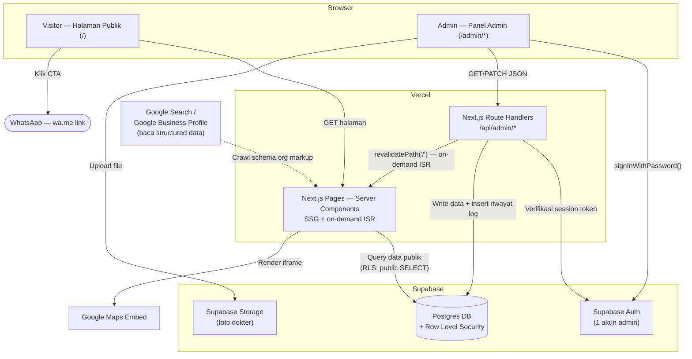
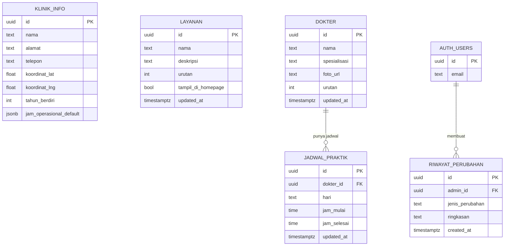

# Technical Specification Document — Landing Page Klinik Cahaya Medika

> **Catatan konteks:** Dokumen ini adalah dokumen keempat dalam rantai standar proyek NobleDev (PRD → SOW → User Flow & Wireframe → **Technical Spec**), diturunkan dari **PRD v1.1**, **SOW** (Fixed-price, Rp 15.000.000 ilustratif), dan **User Flow & Wireframe Document** "Landing Page Klinik Cahaya Medika". Klinik Cahaya Medika tetap studi kasus ilustratif/template internal, bukan klien nyata. Dokumen ini **engineering-facing** — siap dibuka developer di hari pertama build, bukan dokumen sign-off klien.

| Field | Detail |
|---|---|
| Referensi PRD | Landing Page Klinik Cahaya Medika, v1.1 |
| Referensi SOW | Landing Page Klinik Cahaya Medika (Fixed-price, Rp 15.000.000 ilustratif) |
| Referensi User Flow & Wireframe | Landing Page Klinik Cahaya Medika (9 screen, 3 flow) |
| Tipe Proyek | Greenfield — tidak ada codebase/legacy system yang diintegrasikan |
| Tim | Asumsi 1 developer (solo), sesuai estimasi durasi PRD §8/SOW §4 — `[ASUMSI: diturunkan dari "1 developer" di PRD §8, bukan dikonfirmasi terpisah]` |
| Skala Trafik | `[ASUMSI: klinik keluarga skala kecil-menengah, estimasi puluhan–ratusan pengunjung unik/hari, tanpa lonjakan traffic musiman signifikan — tidak ada angka trafik nyata di PRD/SOW, ini asumsi kerja untuk sizing infra]` |
| Status | Draft — Template Internal |

---

## Daftar Isi

1. Ringkasan Teknis
2. Tech Stack
3. System Architecture
4. API Contracts
5. Data Models
6. Non-Functional Requirements
7. Security & Compliance
8. Environments & Deployment
9. Risks & Open Technical Questions
10. Locale Notes (Indonesia-facing)
11. Appendix — Ringkasan Keputusan Arsitektur

---

## 1. Ringkasan Teknis

Proyek ini adalah landing page satu halaman (multi-section) untuk klinik keluarga, dengan panel admin ringan terpisah. Dua karakteristik teknis yang paling menentukan arsitektur:

1. **Konten publik jarang berubah, tapi harus tampil "langsung" saat admin update** (PRD §5 Flow 2: *"Perubahan langsung tampil di halaman publik"*; SOW §8 Acceptance Criteria: admin bisa update dan lihat perubahan tampil ≤5 menit). Ini mengarahkan pilihan ke **Next.js dengan on-demand ISR (Incremental Static Regeneration)**, bukan ISR berbasis interval waktu — dibahas detail di §3 dan §9.
2. **Tidak ada data kesehatan pasien yang dikumpulkan** (PRD §2 Out of Scope, PRD §7 NFR Security: *"data sensitif pasien tidak disimpan"*). Ini secara signifikan menyederhanakan kebutuhan compliance dibanding aplikasi kesehatan pada umumnya — dibahas di §7.

Dokumen ini mengikuti scope PRD v1.1 dan SOW secara ketat. Tidak ada fitur/endpoint/tabel yang ditambahkan di luar apa yang sudah didukung oleh PRD, SOW, atau User Flow & Wireframe Document.

---

## 2. Tech Stack

Mengikuti rekomendasi PRD §6 sebagai starting point (proyek belum punya infra terpasang — greenfield, tim NobleDev solo developer) — tabel di bawah mempertahankan rekomendasi tersebut sekaligus menunjukkan alasan per layer, ditambah dua layer yang belum eksplisit di PRD (File Storage, Background Jobs) yang jadi relevan begitu detail wireframe (upload foto dokter, on-demand revalidation) masuk ke gambaran teknis.

| Layer | Recommended | Alternatives | Rationale |
|---|---|---|---|
| Frontend | Next.js 14+ (App Router), SSG + on-demand ISR | Astro, HTML+Tailwind statis | SSG/ISR memberi LCP terbaik untuk landing page (target PRD §7: ≤2.5 detik) sekaligus mendukung update konten tanpa rebuild manual. Astro lebih ringan untuk situs 100% statis, tapi Next.js dipilih karena panel admin di scope yang sama butuh routing + client-side interactivity — satu framework untuk keduanya mengurangi kompleksitas solo developer. |
| Styling | Tailwind CSS | CSS/SCSS manual | Konsisten dengan design system internal NobleDev (PRD §6), mempercepat build skala kecil. |
| Database & Admin Auth | Supabase — region **Southeast Asia (Singapore)** (Postgres + Supabase Auth + Row Level Security) | Headless CMS ringan (Sanity free tier) | Auth built-in cukup untuk 1 akun admin (PRD §7 NFR Security). RLS memungkinkan data publik dibaca langsung dari frontend tanpa API tambahan (§3), sambil membatasi write hanya ke admin terautentikasi. Region Singapore dipilih karena merupakan region Supabase terdekat ke Indonesia — Supabase secara resmi merekomendasikan memilih region terdekat ke pengguna untuk performa terbaik, dan region ini juga menentukan lokasi penyimpanan data utama. Sanity lebih unggul untuk rich-text/banyak gambar, tapi Klinik Cahaya Medika hanya butuh field sederhana (PRD §4 Modul 6: *"form minimal, tanpa rich-text editor penuh"*) — jadi kompleksitas Sanity tidak sepadan. |
| File Storage | Supabase Storage | Cloudinary | Foto profil dokter (wireframe S8) adalah kebutuhan storage satu-satunya di scope ini — jumlah file kecil, jarang berubah. Menyatukan storage di platform yang sama dengan DB/Auth menghindari vendor tambahan. Cloudinary unggul di transformasi/optimasi gambar otomatis, tapi berlebihan untuk volume foto sekecil ini. |
| Hosting | Vercel — Function region `sin1` (Singapore), di-set eksplisit via `vercel.json` | Netlify | Native support Next.js App Router + ISR, edge caching global, deployment via git push — cocok untuk maintain solo developer (PRD §6). Region **wajib** di-set eksplisit ke `sin1` — default Vercel Function region adalah `iad1` (US East), yang menambah latency tidak perlu untuk trafik Indonesia. Butuh Vercel Pro plan untuk region non-default. |
| Kanal Komunikasi | WhatsApp click-to-chat (`wa.me` link, tanpa API berbayar) | WhatsApp Cloud API | Cukup untuk volume klinik kecil-menengah (PRD §6). Tidak butuh webhook/messaging endpoint di backend — lihat catatan §10. |
| Background Jobs / Queue | Tidak dipakai | — | Tidak ada scope yang butuh proses asinkron/terjadwal (tidak ada notifikasi email, tidak ada reminder). Section ini sengaja tidak diisi lebih jauh — menambahnya sekarang akan jadi over-engineering untuk MVP ini. |
| Analytics | Vercel Analytics / Google Analytics 4 | — | Memantau sumber trafik pencarian lokal tanpa biaya tambahan berarti (PRD §6). |

> **Catatan konsistensi harga:** Payment gateway (Midtrans/Xendit/QRIS) sengaja tidak muncul di tabel ini — konsisten dengan PRD §6 yang secara eksplisit menyatakan *"tidak berlaku untuk MVP ini"*. Ditambahkan hanya jika scope booking/pembayaran online masuk lewat change request (SOW §7).

---

## 3. System Architecture

### 3.1 Monolith vs. Services

**Keputusan: monolith tipis (thin monolith)** — satu aplikasi Next.js yang melayani baik halaman publik (Server Components, SSG/ISR) maupun panel admin (Client Components + Route Handlers sebagai API layer tipis), dengan Supabase sebagai backend-as-a-service untuk data, auth, dan storage.

Tidak ada alasan konkret untuk split lebih jauh (microservices, backend terpisah) di scope ini — tidak ada beban kerja yang genuinely berbeda (tidak ada proses berat/async, tidak ada tim terpisah yang memiliki service berbeda). Memecah ini jadi beberapa service hanya akan menambah biaya operasional & kompleksitas deployment untuk solo developer tanpa manfaat nyata — pola over-engineering yang sengaja dihindari di sini.

### 3.2 Component/Service Map



### 3.3 Request/Data Flow — Dua Alur Representatif

**Flow 1 — Visitor: Load Homepage + Cek Status Buka/Tutup** *(stress test untuk performa & keakuratan real-time)*

1. Visitor request `/` → Vercel edge menyajikan halaman dari cache ISR (tidak query DB langsung setiap request — inilah yang menjaga LCP ≤2.5 detik, PRD §7).
2. Data jadwal & info layanan sudah ter-*bake* ke dalam HTML saat generation/revalidation terakhir (lihat §3.4 untuk kapan revalidation terjadi).
3. **Status "Buka Sekarang"/"Tutup" dihitung di client-side (browser JS)** dari data jadwal yang sudah ada di halaman + waktu saat ini (timezone Asia/Jakarta di-hardcode, bukan timezone browser pengunjung — lihat §10) — bukan dihitung ulang di server saat page generation. Ini keputusan arsitektur eksplisit: kalau status dihitung saat build/revalidate saja, badge bisa salah beberapa jam sebelum revalidation berikutnya terjadi. Hitung di client memastikan badge selalu akurat terlepas dari kapan cache terakhir di-generate.
4. Visitor klik CTA WhatsApp → redirect ke `wa.me` link dengan pesan pre-filled (keputusan UX §5 wireframe doc) — tidak menyentuh backend NobleDev sama sekali.

**Flow 2 — Admin: Update Jadwal Dokter** *(stress test untuk auth, write path, dan requirement "langsung tampil")*

1. Admin login via Supabase Auth `signInWithPassword()` langsung dari client (bukan lewat custom API route — Supabase Auth SDK menangani ini native).
2. Admin submit form edit jadwal (wireframe S7) → `PATCH /api/admin/jadwal`.
3. Route Handler memverifikasi session Supabase (menolak jika tidak terautentikasi/token invalid).
4. Route Handler melakukan upsert ke tabel `jadwal_praktik`, lalu insert baris baru ke `riwayat_perubahan` dalam satu operasi (idealnya dalam satu Postgres transaction agar keduanya konsisten).
5. Setelah write sukses, Route Handler memanggil `revalidatePath('/')` (Next.js on-demand ISR) — **ini kunci untuk memenuhi SOW §8**: perubahan tampil di halaman publik dalam hitungan detik, bukan menunggu interval revalidate berikutnya.
6. Response sukses dikirim ke admin panel → toast konfirmasi (wireframe S7 state "Success").

### 3.4 Revalidation Strategy (Keputusan Eksplisit)

**On-demand ISR via `revalidatePath()`/`revalidateTag()`**, dipicu dari setiap Route Handler admin setelah write sukses — **bukan** time-based ISR (`revalidate: N detik`). Alasan: requirement SOW §8 ("perubahan tampil ≤5 menit, diverifikasi lewat sesi handover") dan PRD Flow 2 ("perubahan langsung tampil") jauh lebih mudah dipenuhi secara konsisten dengan trigger eksplisit setelah write, dibanding menebak interval waktu yang cukup pendek tanpa membebani build/edge cache dengan revalidation yang terlalu sering untuk konten yang sebenarnya jarang berubah.

---

## 4. API Contracts

### 4.1 Prinsip Umum

- **Auth model:** Supabase Auth (email + password, 1 akun admin — PRD §7). Login memakai Supabase Auth SDK langsung dari client (`signInWithPassword`), **bukan** custom endpoint — tidak ada `POST /api/auth/login` yang perlu dibangun manual. Setiap Route Handler admin memverifikasi session Supabase di server sebelum memproses request.
- **Authorization:** Karena hanya ada 1 role admin (tidak ada tier admin bertingkat di PRD §3), authorization sesederhana "apakah request punya session admin yang valid" — tidak perlu role-based access control (RBAC) kompleks.
- **Data publik (GET):** Tidak melalui custom REST endpoint. Server Components Next.js query langsung ke Supabase memakai `anon key` + kebijakan RLS `SELECT` publik, saat page generation/revalidation (§3.3–3.4). Ini mengurangi jumlah API surface yang perlu di-maintain dan cocok dengan pola SSG/ISR.
- **Versioning:** Tidak diberi versioning eksplisit (`/v1/`, dst.) — hanya ada satu client (aplikasi Next.js yang sama) yang memanggil endpoint ini, sehingga versioning belum memberi manfaat nyata pada tahap ini. `[ASUMSI: bisa direvisi jika ke depan ada client kedua, mis. app mobile]`.

### 4.2 Endpoint Table

| Method | Path | Auth | Deskripsi |
|---|---|---|---|
| PATCH | `/api/admin/jadwal` | Admin (session Supabase) | Update jadwal praktik dokter mingguan; insert entri riwayat perubahan |
| PATCH | `/api/admin/layanan` | Admin (session Supabase) | Update daftar layanan (tambah/edit/hapus item); insert entri riwayat perubahan |
| PATCH | `/api/admin/dokter` | Admin (session Supabase) | Update profil dokter (nama, spesialisasi); insert entri riwayat perubahan |
| POST | `/api/admin/dokter/foto` | Admin (session Supabase) | Upload foto profil dokter ke Supabase Storage, kembalikan URL publik |
| GET | `/api/admin/riwayat` | Admin (session Supabase) | Ambil log riwayat perubahan, reverse-chronological, paginated |

*Skip CRUD publik: seluruh GET untuk konten publik (layanan, jadwal, kontak) ditangani via query langsung Server Component + RLS (§4.1), bukan endpoint REST terpisah — genuinely tidak ada logika bisnis non-trivial di baliknya yang butuh didokumentasikan sebagai kontrak API.*

### 4.3 Detail Endpoint Non-Trivial

#### `PATCH /api/admin/jadwal`

Request body:

```json
{
  "jadwal": [
    {
      "dokter_id": "uuid",
      "hari": "senin",
      "jam_mulai": "08:00",
      "jam_selesai": "20:00"
    }
  ]
}
```

Response sukses (200):

```json
{
  "success": true,
  "updated_count": 1,
  "revalidated": true
}
```

Response error (400/401):

```json
{
  "success": false,
  "error": "UNAUTHORIZED",
  "message": "Sesi admin tidak valid, silakan login ulang."
}
```

Status codes: `200` sukses, `400` payload invalid (mis. format jam salah), `401` tidak terautentikasi, `500` gagal write ke DB (data input di form **tidak** hilang di sisi client — wireframe S7 state "Error").

#### `GET /api/admin/riwayat`

Query params: `?page=1&limit=20`

Response (200):

```json
{
  "data": [
    {
      "id": "uuid",
      "admin_email": "admin@kliniksample.id",
      "jenis_perubahan": "jadwal",
      "ringkasan": "Update jadwal dr. Andi — Senin",
      "created_at": "2026-08-15T09:12:00+07:00"
    }
  ],
  "page": 1,
  "has_more": false
}
```

*Tanpa filter tanggal — konsisten dengan keputusan UX §5 poin 6 di User Flow & Wireframe Document.*

---

## 5. Data Models

### 5.1 Entity List

| Entity | Tujuan | Field Kunci | Relasi |
|---|---|---|---|
| `klinik_info` | Data profil klinik (singleton — hanya 1 baris) | `nama`, `alamat`, `telepon`, `koordinat_lat`, `koordinat_lng`, `tahun_berdiri`, `jam_operasional_default (jsonb)` | — |
| `layanan` | Daftar layanan klinik (wireframe S2, S8) | `nama`, `deskripsi`, `urutan`, `tampil_di_homepage (bool)` | — |
| `dokter` | Profil dokter/tenaga medis (wireframe S2, S8) | `nama`, `spesialisasi`, `foto_url`, `urutan` | 1-ke-banyak ke `jadwal_praktik` |
| `jadwal_praktik` | Jadwal mingguan per dokter (wireframe S3, S7) | `dokter_id (FK)`, `hari (enum)`, `jam_mulai`, `jam_selesai` | Banyak-ke-1 ke `dokter` |
| `riwayat_perubahan` | Audit log perubahan admin (wireframe S9) | `admin_id (FK ke auth.users)`, `jenis_perubahan (enum)`, `ringkasan`, `created_at` | Banyak-ke-1 ke `auth.users` (Supabase Auth) |

*Admin/user itu sendiri **tidak** punya tabel kustom — dikelola native oleh `auth.users` milik Supabase Auth, sesuai PRD §4 Modul 6 ("Login admin — autentikasi sederhana, 1 akun").*

### 5.2 Entity-Relationship Diagram



### 5.3 Key Design Decisions

- **Soft-delete vs. hard-delete:** Hard-delete dipakai untuk `layanan` dan `jadwal_praktik` — tidak ada requirement audit granular per-field di PRD/SOW, dan `riwayat_perubahan` sudah cukup untuk keperluan "siapa/kapan berubah" (PRD §4 Modul 6). Menambah soft-delete berarti kompleksitas query tambahan yang tidak diminta scope ini.
- **Audit logging:** `riwayat_perubahan` mencatat ringkasan teks (bukan diff before/after penuh) — sesuai keputusan UX §5 poin 5 wireframe doc: *"view-only, tanpa fungsi revert"*. Menyimpan before/after value lengkap hanya bermanfaat kalau ada fitur revert, yang eksplisit di luar scope.
- **Multi-tenancy:** Tidak relevan — proyek ini single-tenant (1 klinik, 1 akun admin). `[ASUMSI: kalau template ini dipakai ulang untuk klien lain, setiap klien dapat instance Supabase project terpisah, bukan berbagi 1 database multi-tenant]`.
- **Enkripsi at rest:** Ditangani native oleh Supabase (Postgres terenkripsi at rest secara default di infrastruktur mereka) — tidak ada field yang genuinely sangat sensitif (tidak ada data kesehatan pasien, PRD §7) sehingga tidak perlu enkripsi kolom tambahan di level aplikasi.
- **`jam_operasional_default` di `klinik_info`:** Dipakai sebagai fallback kalau `jadwal_praktik` untuk minggu berjalan belum diisi admin — sesuai wireframe S3 state "Empty" yang menyebutkan fallback ke jam operasional default.

---

## 6. Non-Functional Requirements

| Requirement | Target | Sumber |
|---|---|---|
| LCP homepage | ≤ 2.5 detik pada simulasi 4G | PRD §7 [Core Web Vitals "Good" threshold] |
| Total page weight homepage | ≤ 1.5MB termasuk gambar | PRD §7 `[ASUMSI: praktik umum landing page performant]` |
| Update konten oleh admin tampil di publik | ≤ beberapa detik (via on-demand ISR), diverifikasi ≤5 menit saat handover | SOW §8, ditegakkan lewat keputusan arsitektur §3.4 |
| Uptime | 99.5% | PRD §7 `[standar umum static hosting, bukan SLA formal tertulis]` |
| Kontras warna | Minimum WCAG AA (≥4.5:1) | PRD §7 |
| Ukuran font dasar | Minimum 16px | PRD §7 |
| Responsive breakpoints | 360px, 768px, 1280px (mobile-first) | PRD §7 |
| Autentikasi admin | Email + password, 1 akun, via Supabase Auth | PRD §7 |
| Observability | Error tracking untuk Route Handler admin (mis. Vercel's built-in function logs) | `[ASUMSI: tidak ada tool observability eksternal disebut di PRD/SOW; untuk skala proyek ini, log bawaan Vercel + Supabase dashboard cukup — pertimbangkan Sentry kalau volume error monitoring naik]` |

---

## 7. Security & Compliance

### 7.1 Auth & Authorization

Supabase Auth menangani hashing password (bcrypt) dan session management secara native — tidak ada implementasi auth kustom. Row Level Security (RLS) di Postgres jadi lapisan otorisasi utama:

- Tabel publik (`layanan`, `dokter`, `jadwal_praktik`, `klinik_info`): kebijakan `SELECT` terbuka untuk role `anon` (dibaca Server Components saat generation), kebijakan `INSERT/UPDATE/DELETE` hanya untuk role `authenticated` yang cocok dengan 1 admin UID yang di-provision.
- Tabel `riwayat_perubahan`: `SELECT` dan `INSERT` hanya untuk role `authenticated` (admin) — tidak pernah dibaca publik.

### 7.2 Klasifikasi Data

- **Tidak ada data kesehatan pasien** yang dikumpulkan lewat form apa pun — sesuai PRD §7 (*"data minimization by design"*). Ini secara material mengurangi cakupan compliance dibanding aplikasi kesehatan pada umumnya.
- **Data personal yang benar-benar tersimpan:** hanya email admin (1 akun, dikelola pemilik klinik sendiri) dan opsional foto profil dokter (data profesional, bukan data kesehatan pasien).
- **Interaksi WhatsApp** (isi chat, nomor telepon calon pasien yang menghubungi) terjadi sepenuhnya di platform WhatsApp/Meta — di luar boundary data yang dikelola sistem NobleDev, karena implementasi hanya link `wa.me`, bukan integrasi Cloud API yang menyimpan riwayat chat di sisi kita (lihat §10).

### 7.3 UU PDP (Undang-Undang No. 27/2022 tentang Pelindungan Data Pribadi)

Karena data personal yang dikelola sistem ini sangat minim (hanya kredensial 1 admin), eksposur terhadap UU PDP jauh lebih kecil dibanding aplikasi yang mengumpulkan data pengunjung. Namun tetap relevan untuk dicatat:

- Email admin adalah data pribadi — penyimpanannya oleh Supabase (pemroses data pihak ketiga) tetap perlu diperhatikan dari sisi persetujuan/perjanjian pemrosesan data, terutama soal lokasi server Supabase (data residency).
- **Ini bukan nasihat hukum** — `[REKOMENDASI: minta klien nyata mengonfirmasi ke penasihat hukum/compliance mereka jika proyek ini pernah dijalankan dengan data klien sungguhan, khususnya terkait lokasi hosting data di Supabase]`.

### 7.4 Transport & Infra Security

- HTTPS wajib di seluruh halaman (default Vercel, PRD §7).
- Environment variable (Supabase URL, anon key, service role key) disimpan di Vercel Environment Variables, tidak pernah di-commit ke repository — `service_role` key khususnya **hanya** dipakai di Route Handler server-side, tidak pernah diekspos ke client bundle.

---

## 8. Environments & Deployment

| Environment | Tujuan | Catatan |
|---|---|---|
| Development | Local development | Next.js dev server lokal + Supabase project development (atau Supabase local via CLI) |
| Preview | Review sebelum merge ke production | Vercel Preview Deployment otomatis per pull request (bawaan git integration Vercel) — cukup berfungsi sebagai staging untuk proyek sekecil ini, sehingga environment staging terpisah **tidak** dibuat khusus |
| Production | Live untuk klien | Vercel Production deployment dari branch `main`, terhubung ke Supabase project production |

**CI/CD:** Push ke `main` → Vercel build otomatis (Next.js build + type check) → deploy ke production jika build sukses. Pull request → Vercel Preview Deployment otomatis untuk review. `[ASUMSI: tidak disebutkan requirement test suite formal di PRD/SOW untuk proyek sekecil ini — build check dari `next build` menjadi gerbang kualitas minimum; bisa ditambah GitHub Actions untuk linting jika tim berkembang]`.

**Rollback:** Vercel mendukung instant rollback ke deployment sebelumnya lewat dashboard/CLI. Untuk perubahan skema database, gunakan file migrasi SQL bervensi (Supabase CLI `migrations/`) agar skema bisa di-revert secara terkontrol, bukan diubah manual lewat dashboard Supabase di production.

---

## 9. Risks & Open Technical Questions

| Risiko Teknis | Impact | Mitigasi |
|---|---|---|
| On-demand revalidation gagal terpanggil (mis. error di Route Handler setelah write DB sukses) → data admin ter-update tapi halaman publik belum berubah | Sedang — SOW §8 acceptance criteria tidak terpenuhi | Wrap write DB + `revalidatePath()` dalam try-catch dengan logging; kalau revalidation gagal, tetap tampilkan sukses ke admin tapi log error untuk retry manual/investigasi |
| Perhitungan status "Buka/Tutup" di client-side salah karena bug timezone (memakai timezone browser, bukan Asia/Jakarta) | Sedang — badge status jadi elemen paling menonjol di Flow B (wireframe S3), kesalahan di sini langsung terlihat pengunjung | Hardcode `Asia/Jakarta` secara eksplisit di logika perhitungan (lihat §10), tulis unit test khusus untuk edge case (tengah malam, pergantian hari) |
| Kapasitas free/starter tier Supabase (bandwidth, storage, koneksi) belum diverifikasi cukup untuk skala trafik nyata | Rendah — proyek ini masih ilustratif | `[PERTANYAAN TERBUKA: konfirmasi tier Supabase yang dipakai dan limitnya sebelum proyek nyata berjalan, terutama kalau traffic ternyata jauh di atas asumsi §"Skala Trafik" di cover]` |
| Upload foto dokter tanpa validasi ukuran/format yang ketat bisa membengkakkan storage atau merusak layout (wireframe S8 state "Error" menyebutkan validasi ukuran/format) | Rendah | Validasi ukuran file & tipe MIME di Route Handler `POST /api/admin/dokter/foto` sebelum upload ke Supabase Storage |

### 9.1 Pertanyaan Teknis Terbuka — Sudah Dijawab

*Ditutup di bawah ini dengan keputusan final + peran yang paling relevan untuk menjawabnya, karena ketiganya butuh sudut pandang berbeda (infra engineering, keputusan komersial agency, arsitektur). Ini bukan lagi item terbuka — kalau ingin diubah, perlakukan sebagai revisi terdokumentasi, bukan asumsi diam-diam.*

1. **Region Supabase — dijawab dari sudut pandang Infrastructure/Backend Engineer.**
   **Keputusan: Southeast Asia (Singapore).** Supabase secara resmi merekomendasikan region terdekat ke pengguna untuk performa terbaik, dan region tersebut juga menentukan lokasi penyimpanan data utama. Singapore adalah region Supabase terdekat ke Indonesia. **Konsekuensi yang harus ikut dikonfigurasi:** Vercel Function region (untuk Route Handler `/api/admin/*`) wajib di-set eksplisit ke `sin1` lewat `vercel.json` — default Vercel adalah `iad1` (US East), yang menambah round-trip tidak perlu antara compute dan database kalau dibiarkan default. Lihat §2 (Tech Stack).

2. **Kepemilikan akun Vercel & Supabase pasca-handover — dijawab dari sudut pandang Agency Principal / Account Manager NobleDev.**
   Ini bukan pertanyaan teknis murni — jawabannya keputusan komersial, bukan fakta yang bisa diverifikasi lewat dokumentasi teknis. **Rekomendasi:** NobleDev tetap memegang akses owner/admin selama periode dukungan pasca-launch yang disepakati, klien ditambahkan sebagai co-owner/collaborator — bukan transfer penuh langsung saat handover, supaya perbaikan bug pasca-launch tidak terhambat menunggu akses balik dari klien. `[REKOMENDASI — harus dikunci secara formal di SOW §9 "Ketentuan Lain" yang saat ini masih `[ISI]`, bukan diasumsikan lewat TSD ini]`.

3. **Staging environment terpisah — dijawab dari sudut pandang Tech Lead / Solutions Architect.**
   **Keputusan: tidak perlu untuk MVP ini.** Vercel Preview Deployment per pull request sudah cukup sebagai lapisan review (§8). **Pemicu yang mengubah keputusan ini:** begitu scope naik ke area yang saat ini masuk Exclusions PRD §2 (booking system, payment gateway Midtrans/Xendit) — bukan karena kode bertambah kompleks, tapi karena integrasi payment gateway umumnya butuh sandbox callback URL yang stabil untuk testing webhook, sementara Preview URL Vercel berubah tiap PR. Kalau itu terjadi, staging permanen (domain tetap + Supabase project staging terpisah) masuk sebagai bagian dari estimasi Change Request (SOW §7), bukan ditambahkan informal ke infrastruktur yang sudah berjalan.

---

## 10. Locale Notes (Indonesia-facing)

- **UU PDP:** dibahas di §7.3 — eksposur rendah karena minimnya data personal yang dikelola sistem, tapi tetap dicatat, bukan diasumsikan aman begitu saja.
- **WhatsApp:** implementasi murni `wa.me` link (klik-untuk-chat), **tanpa** WhatsApp Business Cloud API — artinya **tidak ada** webhook, message template, atau rate limit yang perlu ditangani di backend. Kalau proyek naik ke Cloud API di fase lanjutan (PRD §6 menyebut ini sebagai opsi upgrade), bagian ini perlu direvisi untuk mencakup webhook endpoint, verifikasi signature, dan template message approval flow dari Meta.
- **Timezone:** Seluruh logika terkait jam operasional dan status buka/tutup **wajib** memakai `Asia/Jakarta` yang di-hardcode di kode (baik di server saat generation maupun di client saat perhitungan real-time di §3.3), bukan timezone browser pengunjung atau timezone server hosting — konsisten dengan PRD §6 catatan lokal.
- **Payment gateway (Midtrans/Xendit/QRIS):** tidak berlaku, konsisten dengan PRD §6 dan Exclusions SOW §3 — sengaja tidak muncul di manapun dalam dokumen ini kecuali sebagai catatan bahwa ini eksplisit di luar scope, bukan terlewat.

---

## 11. Appendix — Ringkasan Keputusan Arsitektur

Ringkasan keputusan yang mahal untuk diubah belakangan, dikumpulkan di satu tempat untuk referensi cepat:

1. Monolith tipis (Next.js + Supabase), bukan microservices — §3.1
2. On-demand ISR (`revalidatePath` dipicu dari write), bukan time-based revalidation — §3.4
3. Status buka/tutup dihitung client-side dari data + waktu saat ini, bukan di-bake saat server render — §3.3
4. Data publik dibaca langsung dari Supabase via Server Component + RLS, tidak lewat REST API kustom — §4.1
5. Login admin memakai Supabase Auth SDK langsung, tidak ada custom auth endpoint — §4.1
6. Audit log (`riwayat_perubahan`) menyimpan ringkasan teks, bukan diff before/after penuh — §5.3
7. Tidak ada background job/queue — tidak ada kebutuhan proses asinkron di scope ini — §2

---

*Dokumen ini siap dipakai sebagai referensi build hari pertama. Kalau proyek berkembang di luar MVP (mis. booking system, WhatsApp Cloud API, multi-cabang — lihat Exclusions SOW §3), bagian yang relevan di dokumen ini (§3, §4, §5, §10) perlu direvisi sebagai bagian dari proses change request formal (SOW §7), bukan ditambahkan informal ke spec yang sudah ada.*
