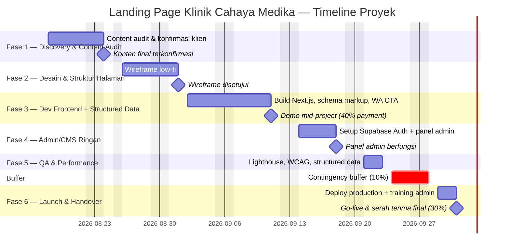

# Project Timeline & Milestones — Landing Page Klinik Cahaya Medika

> **Catatan konteks:** Dokumen ini adalah dokumen kelima dalam rantai standar proyek NobleDev (PRD → SOW → User Flow & Wireframe → Technical Spec → **Timeline & Milestones**), diturunkan dari **PRD v1.1**, **SOW** (Fixed-price, Rp 15.000.000 ilustratif), **User Flow & Wireframe Document** (9 screen, 3 flow), dan **Technical Spec** (monolith tipis Next.js + Supabase, region Singapore). Klinik Cahaya Medika tetap studi kasus ilustratif/template internal, bukan klien nyata. Dokumen ini adalah **lapisan penjadwalan** — menjawab *kapan* tiap bagian selesai dan *siapa* yang bertanggung jawab, sesuatu yang belum sepenuhnya dijawab oleh keempat dokumen sebelumnya.

| Field | Detail |
|---|---|
| Referensi PRD | Landing Page Klinik Cahaya Medika, v1.1 |
| Referensi SOW | Landing Page Klinik Cahaya Medika (Fixed-price, Rp 15.000.000 ilustratif) |
| Referensi Tech Spec | Klinik Cahaya Medika Technical Spec (monolith tipis, Next.js + Supabase Singapore) |
| Referensi User Flow & Wireframe | 9 screen (S1–S9), 3 flow (A/B/C) |
| Tier Dokumen | **Standard** (mengikuti "Tingkat Dokumen" di cover PRD) |
| Metodologi | **Phase-based (Waterfall-style)** — lihat alasan di §1 |
| Status | Draft — Template Internal |

---

## 1. Overview

Jadwal ini dibangun dari estimasi 6 fase di **PRD §8** dan tabel jadwal-milggu-per-milggu di **SOW §4**, disilangkan dengan urutan build teknis di **Tech Spec §3** dan pengelompokan screen per fase di **User Flow Doc §1/§4**. Metodologi yang dipakai adalah **phase-based (Waterfall-style)**, bukan sprint — dipilih secara sadar, bukan default, karena tiga alasan yang sudah eksplisit di dokumen sumber: (1) tim proyek adalah **1 developer solo** (Tech Spec cover, diturunkan dari PRD §8), tidak ada kapasitas paralel yang membenarkan ritme sprint; (2) Tech Spec §3.1 secara eksplisit memilih **monolith tipis tanpa split service/tim**, artinya tidak ada dua alur kerja yang genuinely berjalan bersamaan; (3) PRD §8 dan SOW §4 sudah memakai bahasa "Fase" dan milestone bertanggal, bukan bahasa sprint/backlog.

**Anchor date:** Karena Klinik Cahaya Medika adalah proyek ilustratif (belum ada kontrak/kickoff sungguhan), dokumen ini memakai **Selasa, 18 Agustus 2026** sebagai tanggal kickoff ilustratif — `[ASUMSI/PLACEHOLDER: ganti dengan tanggal kickoff aktual begitu kontrak ditandatangani; lihat §9]`. Tanggal ini dipilih sengaja **satu hari setelah** 17 Agustus (Hari Kemerdekaan RI, libur nasional), bukan sembarang. Seluruh tanggal di bawah memakai kalender kerja Senin–Jumat, zona waktu **WIB (Asia/Jakarta)**, dan sudah mengecualikan dua hari libur nasional yang jatuh di rentang proyek: **17 Agustus 2026** (Proklamasi Kemerdekaan) dan **25 Agustus 2026** (Maulid Nabi Muhammad SAW) — keduanya bersumber dari SKB 3 Menteri Nomor 1497/2025, Nomor 2/2025, dan Nomor 5/2025 tentang Hari Libur Nasional dan Cuti Bersama 2026. Tidak ada cuti bersama tambahan yang jatuh di rentang Agustus–Oktober 2026 ini.

Total jadwal: **32 hari kerja** (≈6,5 minggu kalender), dari kickoff 18 Agustus 2026 hingga selesai serah terima 1 Oktober 2026, termasuk buffer kontingensi 3 hari kerja. **Catatan:** angka ini terdiri dari total kerja per-fase ~5,5 minggu (mengikuti tabel mingguan SOW §4 yang sudah selaras dengan PRD §8 v1.1, lihat §9 poin 2) ditambah buffer kontingensi standar. Selisih yang sebelumnya ada antara estimasi ringkas PRD ("~4–5 minggu" di v1.0) dan tabel rinci SOW **sudah diselesaikan** — PRD §8 direvisi ke v1.1 mengikuti angka SOW, bukan lagi selisih terbuka.

---

## 2. Work Breakdown

| Fase | Tanggal (hari kerja) | Tujuan | Fitur PRD | Deliverable/Milestone SOW | Komponen Tech Spec |
|---|---|---|---|---|---|
| **1 — Discovery & Content Audit** | Sel 18 – Sen 24 Agu 2026 (5 hari) | Konfirmasi seluruh konten dari klien (layanan, jadwal, foto, copy, alamat, jam operasional) — fondasi seluruh fase berikutnya | §8 Phase 1; §9 risiko "klien lambat memberikan konten" | §4 Minggu 1 — "Konten terkonfirmasi"; §6 Client Responsibilities (deadline akhir Minggu 1); trigger pembayaran 30% saat kickoff | — (belum ada build teknis) |
| **2 — Desain & Struktur Halaman** | Rab 26 Agu – Sel 1 Sep 2026 (5 hari) | Wireframe low-fi & struktur konten homepage/layanan/kontak disetujui klien | §8 Phase 2 | §4 Minggu 2 — "Wireframe low-fi disetujui" | Referensi struktur S1–S4 di User Flow Doc §3 (belum dibangun) |
| **3 — Development Frontend + Structured Data** | Rab 2 – Jum 11 Sep 2026 (8 hari) | Build halaman Next.js (S1–S4), schema.org markup, integrasi CTA WhatsApp; siap didemokan | §4 Modul 1–5; §8 Phase 3 | §4 Minggu 3–4.5 — "Homepage, Info Layanan, Jadwal, Kontak selesai; structured data terpasang"; trigger pembayaran 40% saat demo | §2 Tech Stack (Next.js/Tailwind/Supabase setup); §3.3 Flow 1; §5 Data Models (`klinik_info`, `layanan`, `dokter`, `jadwal_praktik`) |
| **4 — Admin/CMS Ringan** | Sen 14 – Jum 18 Sep 2026 (5 hari) | Panel admin berfungsi (S5–S9), auth aktif, riwayat perubahan tercatat | §4 Modul 6; §8 Phase 4 | §4 Minggu 4.5–5.5 — "Panel admin berfungsi, auth aktif" | §3.3 Flow 2; §4 API Contracts (`/api/admin/*`); §5 `riwayat_perubahan`; §7 Auth & RLS |
| **5 — QA, Aksesibilitas & Performance** | Sen 21 – Rab 23 Sep 2026 (3 hari) | Lighthouse audit lolos target NFR, testing lintas perangkat/breakpoint, validasi structured data | §7 NFR; §8 Phase 5 | §8 Acceptance Criteria (LCP, WCAG AA, validasi structured data) | §6 NFR table; §9 risiko teknis (unit test timezone Asia/Jakarta) |
| **Buffer — Contingency** | Kam 24 – Sen 28 Sep 2026 (3 hari) | Ruang cadangan untuk revisi hasil QA sebelum go-live | — (item lapisan jadwal, lihat §6) | — | — |
| **6 — Launch & Handover** | Sel 29 Sep – Kam 1 Okt 2026 (3 hari) | Live di domain klien, dokumentasi admin, training pemilik (≤15 menit) | §8 Phase 6 | §4 Minggu 6–6.5 — "Live di domain klien, training selesai"; trigger pembayaran 30% final; §6 syarat akses domain | §8 Environments & Deployment (deploy production dari branch `main`) |

---

## 3. Milestone Schedule

| Milestone | Tanggal Target | Definisi "Selesai" | Trigger Pembayaran SOW |
|---|---|---|---|
| M0 — Kickoff / kontrak ditandatangani | Sel, 18 Agu 2026 | Kontrak ditandatangani, akses awal (repo, akun) disiapkan | **30% — Rp 4.500.000** saat kickoff |
| M1 — Konten final terkonfirmasi | Sen, 24 Agu 2026 | Seluruh konten (layanan, jadwal, foto, copy, alamat, jam operasional) diterima & dikonfirmasi klien | — |
| M2 — Wireframe low-fi disetujui | Sel, 1 Sep 2026 | Struktur halaman & wireframe low-fi disetujui tertulis oleh klien | — |
| M3 — Demo mid-project | Jum, 11 Sep 2026 | Homepage, Info Layanan, Jadwal, Kontak selesai dibangun; structured data terpasang; didemokan ke klien | **40% — Rp 6.000.000** saat demo |
| M4 — Panel admin berfungsi | Jum, 18 Sep 2026 | Login admin, edit jadwal/layanan, dan riwayat perubahan berfungsi end-to-end | — |
| M5 — QA lolos target NFR | Rab, 23 Sep 2026 | Lighthouse audit lolos (LCP ≤2.5s, WCAG AA), Google Rich Results Test lolos tanpa error | — |
| M6 — Buffer checkpoint | Sen, 28 Sep 2026 | Revisi hasil QA (jika ada) selesai; sistem siap deploy final | — |
| M7 — Launch & serah terima final | Kam, 1 Okt 2026 | Live di domain klien, training admin ≤15 menit selesai, acceptance criteria SOW §8 terpenuhi | **30% — Rp 4.500.000** saat serah terima final |

*Total nilai proyek Rp 15.000.000 (ilustratif), sesuai SOW §5 — tiga trigger di atas menjumlahkan seluruh pembayaran.*

---

## 4. Task Ownership (RACI)

*Karena tim proyek adalah 1 developer solo (Tech Spec, diturunkan dari PRD §8), peran `[PM/Account Manager – NobleDev]` dan `[Solo Developer – NobleDev]` di bawah ini bisa jadi orang yang sama secara operasional — dipisah sebagai peran fungsional (bukan headcount) agar akuntabilitas tetap jelas per jenis keputusan. Ganti placeholder `[...]` dengan nama asli begitu tim final ditentukan.*

| Task/Deliverable | R (Responsible) | A (Accountable) | C (Consulted) | I (Informed) |
|---|---|---|---|---|
| Kumpulkan & audit konten dari klien (Fase 1) | [PM/Account Manager – NobleDev] | [PM/Account Manager – NobleDev] | [Pemilik Klinik] | [Solo Developer – NobleDev] |
| Wireframe low-fi & struktur halaman (Fase 2) | [Solo Developer – NobleDev] | [PM/Account Manager – NobleDev] | [Pemilik Klinik] (approval) | — |
| Build frontend + schema markup (Fase 3) | [Solo Developer – NobleDev] | [Solo Developer – NobleDev] | [PM/Account Manager – NobleDev] | [Pemilik Klinik] |
| Demo mid-project ke klien | [PM/Account Manager – NobleDev] | [PM/Account Manager – NobleDev] | [Solo Developer – NobleDev] | — |
| Setup Supabase Auth + panel admin (Fase 4) | [Solo Developer – NobleDev] | [Solo Developer – NobleDev] | — | [Pemilik Klinik] |
| QA — Lighthouse, aksesibilitas, structured data (Fase 5) | [Solo Developer – NobleDev] | [PM/Account Manager – NobleDev] (akuntabel atas acceptance criteria SOW §8) | — | [Pemilik Klinik] |
| Registrasi/akses domain (Client Responsibility, SOW §6) | [Pemilik Klinik] | [Pemilik Klinik] | [Solo Developer – NobleDev] | [PM/Account Manager – NobleDev] |
| Deploy production + DNS cutover (Fase 6) | [Solo Developer – NobleDev] | [Solo Developer – NobleDev] | [Pemilik Klinik] (akses domain) | [PM/Account Manager – NobleDev] |
| Dokumentasi & training admin panel (Fase 6) | [PM/Account Manager – NobleDev] | [PM/Account Manager – NobleDev] | [Solo Developer – NobleDev] | — |
| Invoicing tiap payment trigger | [PM/Account Manager – NobleDev] | [PM/Account Manager – NobleDev] | — | [Pemilik Klinik] |
| Scoping change request (jika muncul di tengah proyek) | [PM/Account Manager – NobleDev] | [PM/Account Manager – NobleDev] | [Solo Developer – NobleDev] (estimasi teknis) | [Pemilik Klinik] |

---

## 5. Dependencies & Critical Path

Karena proyek ini adalah **monolith tipis dengan 1 developer solo tanpa split tim** (Tech Spec §3.1), praktis **seluruh rantai fase berada di critical path** — tidak ada jalur kerja paralel yang punya slack untuk menyerap keterlambatan di jalur lain. Urutan dependency:

1. **Fase 1 → Fase 2**: Desain/wireframe butuh daftar layanan & struktur konten final dari Fase 1. Ini juga dependency berisiko tertinggi — PRD §9 secara eksplisit menandai keterlambatan konten klien sebagai risiko "Tinggi" dengan mitigasi *content checklist* di awal Fase 1.
2. **Fase 2 → Fase 3**: Development frontend dibangun dari struktur wireframe yang sudah disetujui klien, bukan sambil menunggu approval.
3. **Fase 3 → Fase 4**: Skema database (`layanan`, `dokter`, `jadwal_praktik`) yang dibuat saat build frontend (Fase 3) adalah tabel yang sama yang dipakai form admin (Fase 4) untuk write — panel admin tidak bisa dibangun sebelum skema ini ada, sesuai urutan Modul di PRD §8 dan Data Models Tech Spec §5.
4. **Fase 4 → Fase 5**: QA aksesibilitas & performance (termasuk uji "training admin ≤15 menit" di NFR PRD §7) butuh panel admin yang sudah lengkap untuk diuji secara end-to-end.
5. **Fase 5 → Buffer → Fase 6**: Launch hanya terjadi setelah Lighthouse audit dan validasi Google Rich Results Test lolos (SOW §8 Acceptance Criteria) — buffer ditempatkan di sini untuk menyerap siklus revisi sebelum go-live tanpa menggeser tanggal launch yang sudah dikomunikasikan.

**Dependency eksternal (di luar kendali NobleDev, tapi tetap di critical path):**
- **Konten final dari klien** (SOW §6, deadline akhir Minggu 1) — memblokir mulainya Fase 2.
- **Akses/registrasi domain dari klien** (SOW §6, harus tersedia sebelum Fase Launch) — memblokir DNS cutover di Fase 6; sebaiknya dicek ulang statusnya saat Fase 4 berjalan, bukan ditunggu sampai Fase 6 dimulai.

---

## 6. Buffer Time & Contingency

**Pendekatan yang dipakai: percentage-based contingency, ~10% dari total jadwal** — sesuai default untuk proyek NobleDev skala kecil-menengah (Standard tier). Total kerja inti (Fase 1–6 tanpa buffer) adalah 29 hari kerja; 10% dari itu dibulatkan ke **3 hari kerja**, ditempatkan sebagai satu blok eksplisit **setelah QA (Fase 5) dan sebelum Launch (Fase 6)** — bukan disebar tipis ke tiap fase — agar buffer terlihat jelas di jadwal, bukan tersembunyi di dalam estimasi tiap fase (praktik yang direkomendasikan karena estimasi bertele tersembunyi cenderung habis terpakai meski tidak dibutuhkan/Parkinson's Law).

**Catatan penting:** buffer 10% ini **tidak** dimaksudkan untuk menyerap keterlambatan konten dari klien di Fase 1 — risiko itu sudah punya mekanismenya sendiri di **SOW §6**: keterlambatan konten klien menggeser seluruh timeline berikutnya sesuai jumlah hari keterlambatan (bukan diserap diam-diam oleh buffer internal ini). Buffer di sini murni untuk risiko sisi NobleDev (revisi QA, isu integrasi kecil yang tidak terduga).

---

## 7. Visual Timeline

*Blok abu-abu di akhir pekan dan tanggal 25 Agustus (Maulid Nabi) ditandai sebagai hari tidak kerja lewat `excludes` — bukan bagian dari durasi kerja tiap fase.*

---

## 8. Schedule Risks

| Risiko | Dampak ke Jadwal | Mitigasi/Buffer |
|---|---|---|
| Klien lambat memberikan konten final (Fase 1 → Fase 2) | Tinggi — menggeser seluruh sisa jadwal 1:1 (SOW §6), tidak diserap buffer §6 | Content checklist dikirim hari pertama Fase 1 dengan deadline eksplisit akhir Minggu 1 |
| Hasil QA (Fase 5) memerlukan revisi signifikan | Sedang — menghabiskan buffer 3 hari kerja | Buffer ditempatkan langsung setelah QA; jika buffer tidak cukup, perlakukan sebagai keterlambatan yang perlu dikomunikasikan, bukan dipaksa masuk tanggal launch semula |
| Solo developer adalah single point of failure (sakit, tidak tersedia) | Tinggi — tidak ada developer cadangan paralel yang bisa menyerap (Tech Spec §3.1: tanpa split tim) | `[REKOMENDASI: NobleDev menyiapkan kontak developer cadangan untuk kontinuitas critical path, karena Tech Spec mengonfirmasi tidak ada redundansi tim di scope ini]` |
| Akses/registrasi domain dari klien belum siap saat Fase 6 dimulai | Sedang — memblokir DNS cutover & go-live | Verifikasi status domain saat Fase 4 berjalan (bukan menunggu sampai Fase 6), sesuai syarat SOW §6 |
| Structured data gagal validasi Google Rich Results Test saat QA (Fase 5) | Sedang-Rendah (PRD §9) | Validasi schema markup dilakukan berkelanjutan selama Fase 3, bukan hanya di gerbang QA Fase 5, agar kegagalan tidak baru ketahuan di akhir critical path |
| Klaster libur nasional Agustus 2026 (17 & 25 Agustus) | Rendah — sudah dikeluarkan dari perhitungan hari kerja di §2/§7 | Tidak perlu tindakan lanjutan untuk rentang proyek ini; cek ulang kalender SKB 3 Menteri jika kickoff aktual bergeser ke bulan lain |

---

## 9. Assumptions & Open Questions

1. **`[ASUMSI/PLACEHOLDER]`** Tanggal kickoff 18 Agustus 2026 bersifat ilustratif (proyek belum punya kontrak nyata) — ganti dengan tanggal kickoff aktual begitu ada, dan tanggal-tanggal di §2/§3/§7 perlu dihitung ulang dari titik itu.
2. **`[SUDAH DISELESAIKAN — sebelumnya item terbuka]`** PRD §8 v1.0 sebelumnya menyebut total estimasi ringkas "~4–5 minggu", sementara tabel mingguan SOW §4 sendiri (Minggu 1 s/d Minggu 6.5) secara implisit menunjukkan ~5,5–6,5 minggu — ini dulu selisih di dokumen sumber yang belum diselaraskan. **Sudah diselesaikan:** PRD direvisi ke **v1.1**, §8-nya kini menyebut "~5.5–6.5 minggu" mengikuti tabel SOW yang lebih rinci. Dokumen ini (Timeline) menambahkan buffer kontingensi 10% di atas angka SOW/PRD v1.1 tersebut, sehingga total akhir jadi ~6,5 minggu kalender (§1) — perbedaan yang tersisa sekarang murni karena buffer, bukan lagi selisih antar-dokumen yang belum diselaraskan.
3. **`[ASUMSI]`** Fase 4 (Admin/CMS Ringan) diberi durasi 5 hari kerja (1 minggu penuh) — batas atas rentang "0,5–1 minggu" di PRD §4 Modul 6, mengikuti angka pasti 1 minggu yang sudah dikomit di tabel SOW §4.
4. **`[ASUMSI]`** Fase 3 dibulatkan dari 1,5 minggu (PRD §8) menjadi 8 hari kerja (dari perhitungan 1,5 × 5 hari = 7,5, dibulatkan ke atas) — pembulatan kerja, bukan angka dari dokumen sumber.
5. **`[ASUMSI]`** Minggu kerja Senin–Jumat, jam kerja WIB (Asia/Jakarta) — tidak disebutkan eksplisit di PRD/SOW/Tech Spec, tapi konsisten dengan catatan lokal PRD §6 dan Tech Spec §10 yang sudah menetapkan Asia/Jakarta sebagai timezone acuan produk.
6. **`[ASUMSI]`** Tim proyek 1 developer solo tanpa developer cadangan — diwarisi langsung dari asumsi Tech Spec cover (*"diturunkan dari '1 developer' di PRD §8, bukan dikonfirmasi terpisah"*). Belum ada nama/roster nyata; RACI di §4 memakai role placeholder yang perlu diganti nama asli.
7. **`[ASUMSI]`** Buffer 10% adalah default tier Standard, bukan angka yang dinegosiasikan dengan klien — lihat §6 untuk penalaran lengkap.
8. Kalender libur nasional Agustus–Oktober 2026 (17 Agustus: Proklamasi Kemerdekaan; 25 Agustus: Maulid Nabi Muhammad SAW) bersumber dari SKB 3 Menteri Nomor 1497 Tahun 2025, Nomor 2 Tahun 2025, dan Nomor 5 Tahun 2025 tentang Hari Libur Nasional dan Cuti Bersama 2026 — tidak ada cuti bersama tambahan yang jatuh di rentang proyek ini.

---

## 10. Change Control Note

Perubahan jadwal mengikuti proses change request yang sama dengan **SOW §7**: setiap pergeseran scope, fitur, atau tanggal milestone di dokumen ini — termasuk pergeseran akibat keterlambatan konten klien (SOW §6) — di-scope ulang, diberi estimasi waktu/biaya terpisah bila relevan, dan memerlukan persetujuan tertulis sebelum tanggal-tanggal di §2/§3/§7 direvisi. Perubahan jadwal tidak diserap secara informal ke dalam rencana yang sudah berjalan.

---

*Dokumen ini siap dipakai sebagai working document internal/PM — update tanggal begitu kickoff aktual terjadi. Diagram Mermaid `gantt` di §7 tetap sinkron dengan tabel di §2/§3 selama direvisi bersamaan.*
