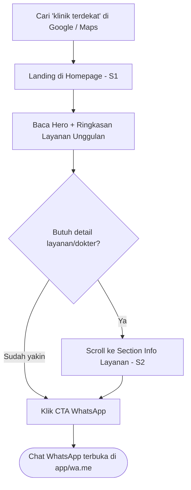
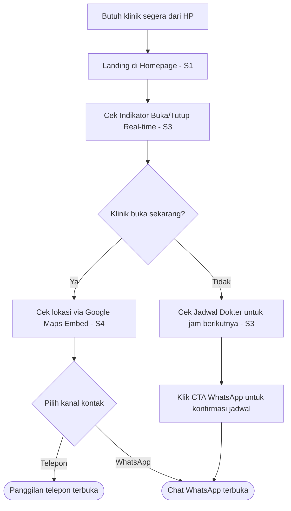
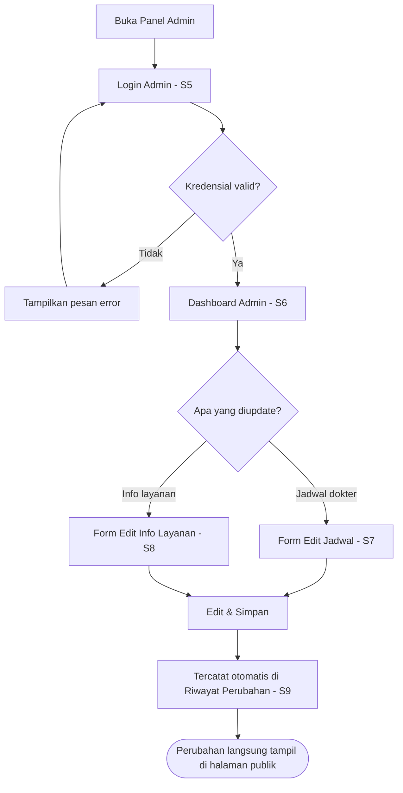

# User Flow & Wireframe Document — Landing Page Klinik Cahaya Medika

> **Catatan konteks:** Dokumen ini adalah dokumen ketiga dalam rantai standar proyek NobleDev (PRD → SOW → User Flow & Wireframe), diturunkan dari **PRD v1.1** dan **SOW** "Landing Page Klinik Cahaya Medika". Sama seperti dua dokumen sumbernya, ini adalah studi kasus ilustratif/template internal — Klinik Cahaya Medika bukan klien nyata. Dokumen ini bersifat **internal/dev-facing** (bukan versi sign-off klien) — defaultnya Markdown dengan diagram Mermaid, siap dipakai untuk brief desainer/developer.

| Field | Detail |
|---|---|
| Referensi PRD | Landing Page Klinik Cahaya Medika, v1.1 |
| Referensi SOW | Landing Page Klinik Cahaya Medika (Fixed-price, Rp 15.000.000 ilustratif) |
| Tier Dokumen | **Standard** (mengikuti "Tingkat Dokumen" di cover PRD) |
| Platform | Web responsif (mobile-first) — disimpulkan dari stack Next.js + breakpoint 360px/768px/1280px di PRD §6–7. *Tidak ada app native disebut di scope.* |
| Struktur Situs | Landing page satu halaman (single-page, multi-section) untuk area publik + panel admin terpisah (multi-screen) |
| Design system existing | Tidak ada — proyek greenfield, styling pakai Tailwind CSS sesuai design system internal NobleDev (PRD §6) |

---

## 1. Screen Inventory

| # | Nama Screen | Role Akses | Fitur PRD (Modul) | Deliverable/Fase SOW | Status |
|---|---|---|---|---|---|
| S1 | Homepage — Hero & CTA WhatsApp | V | Modul 1 — Hero section + CTA WA, Ringkasan layanan, Badge kepercayaan | Deliverable §2 (Homepage); Fase Minggu 3–4.5 | New build |
| S2 | Section Info Layanan & Profil Klinik | V (lihat) / A (edit via S8) | Modul 2 | Deliverable §2; Fase Minggu 3–4.5 | New build |
| S3 | Section Jadwal & Jam Operasional | V (lihat) / A (edit via S7) | Modul 3 | Deliverable §2; Fase Minggu 3–4.5 | New build |
| S4 | Section Kontak & Lokasi | V | Modul 4 | Deliverable §2; Fase Minggu 3–4.5 | New build |
| S5 | Login Admin | A | Modul 6 — Login admin | Deliverable §2 (Panel admin); Fase Minggu 4.5–5.5 | New build |
| S6 | Dashboard Admin | A | Modul 6 (implisit — hub navigasi) | Fase Minggu 4.5–5.5 | New build |
| S7 | Form Edit Jadwal Dokter | A | Modul 3 — Form update jadwal | Fase Minggu 4.5–5.5 | New build |
| S8 | Form Edit Info Layanan & Profil Klinik | A | Modul 2 — Update konten layanan | Fase Minggu 4.5–5.5 | New build |
| S9 | Riwayat Perubahan (Log Admin) | A | Modul 6 — Riwayat perubahan dasar | Fase Minggu 4.5–5.5 | New build |

**Catatan struktur:** S1–S4 bukan halaman terpisah secara routing, melainkan section berurutan pada satu URL (`/`), dihubungkan lewat anchor scroll — konsisten dengan PRD §1 ("landing page satu halaman dengan beberapa section"). SEO/structured data (Modul 5) tidak masuk inventory karena bersifat sistem (markup), bukan screen yang dilihat/dioperasikan user.

---

## 2. User Flow Diagrams

### Flow A — Visitor: Pencarian ke Kontak (jalur utama)
*Sesuai PRD §5 Flow 1. Entry point = pencarian Google/Maps, bukan broadcast WhatsApp — WA di sini adalah tujuan akhir (exit CTA), bukan titik masuk.*



### Flow B — Visitor: Kunjungan Mendesak (mobile)
*Sesuai PRD §5 Flow 3. Dioptimalkan untuk koneksi lambat & keputusan cepat.*



### Flow C — Admin: Update Jadwal & Info Layanan Mandiri
*Sesuai PRD §5 Flow 2. Ditambah percabangan login gagal & pilihan jenis edit — keputusan UX di §5.*



---

## 3. Wireframe Descriptions

### S1 — Homepage: Hero & CTA WhatsApp

- **Layout regions:** Header (logo klinik + nomor telepon klik-untuk-panggil, sticky di mobile) → Hero (headline value proposition + sub-headline + tombol CTA WA besar) → Ringkasan Layanan (grid 3–4 kartu) → Badge Kepercayaan (strip horizontal: tahun berdiri, jam operasional) → Footer (link anchor ke section lain).
- **Komponen per region:** tombol CTA WhatsApp (warna kontras tinggi, ikon WA), 3–4 kartu layanan (ikon + nama layanan + link scroll ke S2), strip fakta (bukan testimoni/rating fiktif — sesuai batasan PRD §4 Modul 1).
- **Content hierarchy:** Tombol CTA WA adalah elemen paling menonjol di viewport pertama (harus terlihat tanpa scroll — target QA PRD §2). Headline kedua paling menonjol; kartu layanan dan badge di bawahnya.
- **States:** Loading (skeleton kartu layanan saat data dari Supabase belum termuat), Populated (default), Error (fallback teks statis jika fetch gagal, CTA WA tetap tampil karena hardcoded, tidak bergantung data dinamis).
- **ASCII sketch:**
```text
[Logo]                          [Tel: 0xx-xxxx]
--------------------------------------------------
   Headline: "Klinik Keluarga Terpercaya di ..."
   Sub-headline singkat
        [ Chat via WhatsApp ]   <- CTA utama
--------------------------------------------------
 [Layanan 1] [Layanan 2] [Layanan 3] [Layanan 4]
--------------------------------------------------
 Berdiri sejak 20XX | Buka: Sen-Sab 08.00-20.00
--------------------------------------------------
```

### S2 — Section Info Layanan & Profil Klinik

- **Layout regions:** Judul section → Daftar layanan (disusun berdasarkan pertanyaan umum pasien, bukan daftar generik — PRD §4 Modul 2) → Profil dokter/tenaga medis (grid kartu foto + nama + spesialisasi).
- **Komponen per region:** List/accordion layanan dengan deskripsi singkat, kartu profil dokter (foto opsional — placeholder jika belum tersedia).
- **Content hierarchy:** Nama layanan lebih menonjol dari deskripsi; foto dokter opsional sehingga layout tidak boleh "pincang" saat foto kosong.
- **States:** Empty (jika admin belum isi profil dokter — tampilkan placeholder ikon generik, bukan broken image), Populated, Loading (skeleton saat fetch dari Supabase).

### S3 — Section Jadwal & Jam Operasional

- **Layout regions:** Judul section → Indikator status real-time (badge besar "Buka Sekarang" / "Tutup") → Tabel jadwal dokter mingguan.
- **Komponen per region:** Badge status dengan warna semantik (hijau = buka, abu/merah = tutup), tabel 7 baris (hari) dengan kolom dokter/jam praktik, dihitung berdasarkan timezone Asia/Jakarta (PRD §6 catatan lokal).
- **Content hierarchy:** Badge status paling menonjol (ini yang dicek duluan di Flow B), tabel jadwal sekunder.
- **States:** Loading (skeleton tabel), Populated, Empty (jika admin belum isi jadwal minggu ini — tampilkan pesan "Jadwal belum diperbarui, hubungi klinik via WA" agar tidak menampilkan tabel kosong membingungkan), Error (fallback ke jam operasional default jika data tidak termuat).

### S4 — Section Kontak & Lokasi

- **Layout regions:** Judul section → CTA WhatsApp (ulang, karena ini CTA utama di seluruh halaman per PRD §4 Modul 4) → Google Maps embed → Info kontak alternatif (telepon, alamat lengkap).
- **Komponen per region:** Peta embed interaktif (klik untuk buka Google Maps app), tombol WA, tombol telepon (`tel:` link), teks alamat lengkap yang bisa di-copy.
- **Content hierarchy:** Peta dan tombol WA sama-sama menonjol (dua kanal aksi utama); alamat teks sebagai pendukung/fallback.
- **States:** Loading (placeholder peta abu-abu saat embed belum termuat — penting untuk koneksi lambat, PRD §5 Flow 3), Populated, Error (jika embed gagal termuat, tampilkan alamat teks + link "Buka di Google Maps" sebagai fallback).

### S5 — Login Admin

- **Layout regions:** Form terpusat (logo klinik + field email + field password + tombol login), tanpa navigasi publik di sekitarnya (halaman terisolasi).
- **Komponen per region:** Input email, input password (dengan toggle show/hide), tombol "Masuk", pesan error inline.
- **Content hierarchy:** Form adalah satu-satunya fokus halaman — minimal distraksi sesuai target NFR "kurva belajar admin panel tanpa training >15 menit" (PRD §7).
- **States:** Default (kosong), Loading (tombol disabled + spinner saat submit), Error (pesan "Email atau password salah" inline di bawah form — keputusan UX di §5), Success (redirect ke S6).

### S6 — Dashboard Admin

- **Layout regions:** Header admin (nama klinik + tombol logout) → Ringkasan singkat (tanggal terakhir update jadwal/layanan) → Navigasi ke 3 aksi utama (Edit Jadwal, Edit Info Layanan, Lihat Riwayat).
- **Komponen per region:** 3 kartu/tombol besar navigasi (bukan sidebar kompleks — konsisten dengan "form minimal, tanpa rich-text editor penuh", PRD §4 Modul 6), indikator ringkas "terakhir diubah: [tanggal] oleh [admin]".
- **Content hierarchy:** 3 kartu navigasi adalah fokus utama; ringkasan status di atasnya sebagai konteks, bukan elemen aksi.
- **States:** Loading (skeleton ringkasan), Populated, Empty (untuk admin baru pertama login — tampilkan pesan "Belum ada perubahan tercatat").

### S7 — Form Edit Jadwal Dokter

- **Layout regions:** Judul form → Tabel input jadwal mingguan (baris = hari, kolom = dokter/jam) → Tombol Simpan (sticky di bawah pada mobile).
- **Komponen per region:** Input jam per hari (dropdown/time-picker sederhana, bukan free-text untuk mencegah kesalahan format), tombol simpan, indikator "perubahan belum disimpan" jika ada edit belum di-submit.
- **Content hierarchy:** Tombol Simpan harus selalu terlihat/reachable — target acceptance criteria SOW §8 "update ≤5 menit per update".
- **States:** Default (menampilkan jadwal saat ini), Editing (highlight field yang diubah), Saving (tombol disabled + spinner), Success (toast "Jadwal berhasil diperbarui" + redirect/tetap di form), Error (pesan jika gagal simpan, data input tidak hilang).

### S8 — Form Edit Info Layanan & Profil Klinik

- **Layout regions:** Judul form → Daftar layanan (tambah/edit/hapus item, field teks singkat per layanan) → Profil dokter (nama, spesialisasi, upload foto opsional) → Tombol Simpan.
- **Komponen per region:** List editable dengan tombol tambah/hapus per baris, field upload gambar sederhana (drag-drop atau pilih file), tombol simpan.
- **Content hierarchy:** Daftar layanan di atas (lebih sering diubah) sebelum profil dokter (lebih jarang diubah).
- **States:** Default, Editing, Uploading (progress saat upload foto), Saving, Success, Error (termasuk validasi ukuran/format file foto).

### S9 — Riwayat Perubahan (Log Admin)

- **Layout regions:** Judul → Tabel log (kolom: tanggal/jam, admin, jenis perubahan, ringkasan) → Pagination sederhana jika log panjang.
- **Komponen per region:** Tabel read-only, tanpa filter tanggal (diputuskan di-drop — lihat §5), dengan tombol "Muat lebih banyak" sederhana jika log makin panjang.
- **Content hierarchy:** Entri terbaru di atas (reverse chronological); tidak ada aksi edit/hapus/revert pada log ini (view-only, lihat §5).
- **States:** Loading, Populated, Empty (admin baru, belum ada histori perubahan).

---

## 4. Traceability Table

| Screen/Flow | PRD Section/Fitur | SOW Deliverable/Milestone |
|---|---|---|
| S1 | §4 Modul 1 (Hero, CTA WA, Ringkasan layanan, Badge kepercayaan) | §2 Deliverable "Homepage lengkap..."; Fase Minggu 3–4.5 |
| S2 | §4 Modul 2 (Daftar layanan, Profil dokter) | §2 Deliverable "Info Layanan & Profil Klinik..."; Fase Minggu 3–4.5 |
| S3 | §4 Modul 3 (Tabel jadwal, Indikator buka/tutup) | §2 Deliverable "Tabel jadwal..."; Fase Minggu 3–4.5 |
| S4 | §4 Modul 4 (WA click-to-chat, Maps embed, Info kontak) | §2 Deliverable "Kontak & Lokasi..."; Fase Minggu 3–4.5 |
| S5 | §4 Modul 6 (Login admin) | §2 Deliverable "Panel admin ringan..."; Fase Minggu 4.5–5.5 |
| S6 | §4 Modul 6 (implisit) | Fase Minggu 4.5–5.5 |
| S7 | §4 Modul 3 (Form update jadwal) | §8 Acceptance "update jadwal ≤5 menit"; Fase Minggu 4.5–5.5 |
| S8 | §4 Modul 2 (Update konten layanan) | Fase Minggu 4.5–5.5 |
| S9 | §4 Modul 6 (Riwayat perubahan dasar) | §2 Deliverable "...log riwayat perubahan dasar"; Fase Minggu 4.5–5.5 |
| Flow A | §5 Flow 1 | Fase Minggu 3–4.5 |
| Flow B | §5 Flow 3 | Fase Minggu 3–4.5 |
| Flow C | §5 Flow 2 | Fase Minggu 4.5–5.5 |

**Exclusions ditegakkan (SOW §3):** tidak ada screen booking slot, portal pasien/login pasien, rekam medis, multi-cabang, payment gateway, atau blog — sesuai daftar exclusion SOW, tidak ada satupun screen di atas yang menyentuh area tersebut.

---

## 5. UX Design Decisions (Assumptions Resolved)

*Enam UX assumption dari draft sebelumnya ditutup di bawah ini dengan keputusan final + alasan. Ini bukan lagi item terbuka untuk klien/PM — kalau ada yang ingin diubah, perlakukan sebagai change request formal (SOW §7), bukan revisi wireframe.*

1. **Dashboard Admin (S6) — DIPERTAHANKAN.**
   Admin tetap mendarat di dashboard dengan 3 kartu navigasi besar (Edit Jadwal / Edit Info Layanan / Riwayat Perubahan) setelah login, bukan langsung dilempar ke satu form.
   *Alasan:* Persona admin di PRD §3 eksplisit "tidak tech-savvy, skeptis ke solusi yang cantik tapi tidak fungsional." Begitu login diarahkan langsung ke Form Edit Jadwal, admin yang sebenarnya mau edit info layanan harus mencari jalan keluar dulu — itu menambah beban kognitif, bukan mengurangi. Hub 3-tombol tetap sejalan dengan target NFR "tanpa training >15 menit" (PRD §7) karena pilihannya cuma 3, bukan menu bertingkat.

2. **State error login (S5) — inline, di form yang sama.**
   Pesan error "Email atau password salah" muncul langsung di bawah field, tanpa reload/redirect ke halaman lain.
   *Alasan:* Ini praktik standar untuk auth error handling (mempertahankan konteks input, sesuai prinsip *error recovery* Nielsen Norman) dan cocok untuk admin non-teknis yang gampang bingung kalau tiba-tiba pindah halaman.

3. **S1–S4 sebagai section satu halaman (anchor scroll), bukan route terpisah — DIKONFIRMASI, bukan diubah.**
   Navigasi header berupa anchor link (`#layanan`, `#jadwal`, `#kontak`) yang scroll ke section, bukan pindah URL.
   *Alasan:* PRD §1 sudah eksplisit menyebut "landing page satu halaman (dengan beberapa section)" — ini bukan asumsi berisiko, hanya perlu ditegaskan di sini agar tidak salah baca oleh desainer/dev. Struktur single-page juga lebih selaras dengan target LCP ≤2.5 detik (PRD §7): satu page load, bukan multi-route.

4. **CTA WhatsApp — link `wa.me` dengan pesan pre-filled, buka tab/app baru.**
   Format: `https://wa.me/62xxxxxxxxxx?text=Halo%2C%20saya%20ingin%20bertanya%20tentang%20layanan%20klinik`. Di mobile, ini otomatis deep-link ke app WhatsApp; di desktop membuka WhatsApp Web di tab baru.
   *Alasan:* Pesan pre-filled mengurangi friksi calon pasien (tidak perlu mengetik ulang konteks) dan memberi staf klinik konteks awal chat — praktik umum untuk WA click-to-chat bisnis lokal. Tetap sesuai batasan PRD §6 "tanpa API berbayar" karena ini murni link `wa.me`, bukan WhatsApp Cloud API.

5. **Riwayat Perubahan (S9) — view-only, tanpa fungsi revert.**
   Admin bisa melihat log tapi tidak bisa mengembalikan versi sebelumnya dari layar ini.
   *Alasan:* PRD §4 Modul 6 hanya menjanjikan "log siapa/kapan konten terakhir diubah" — tidak ada revert di scope maupun di SOW §2. Menambah revert berarti perlu versioning penuh (state lama tiap field, UI konfirmasi, dst.) yang jauh melebihi "Admin/CMS Ringan" yang disepakati. Kalau nanti dibutuhkan, ini masuk change request terpisah.

6. **Filter tanggal pada S9 — DI-DROP dari MVP.**
   Log ditampilkan reverse-chronological apa adanya, dengan tombol "Muat lebih banyak" jika daftar panjang — tanpa date-picker atau filter kompleks.
   *Alasan:* Konsisten dengan risiko yang sudah diantisipasi PRD sendiri di §9 ("Panel didesain minimal (2-3 field), training singkat") — untuk volume perubahan klinik kecil (jadwal + info layanan, diedit tidak setiap hari), filter tanggal adalah kompleksitas yang tidak sepadan dengan manfaatnya di MVP.

---

*Dokumen ini siap dipakai sebagai brief untuk desainer (Figma low-fi) atau langsung untuk breakdown ticket development. Untuk versi client-facing sign-off (.docx), beri tahu saya — diagram Mermaid perlu dirender ke gambar terlebih dahulu sebelum ditempel ke Word.*
